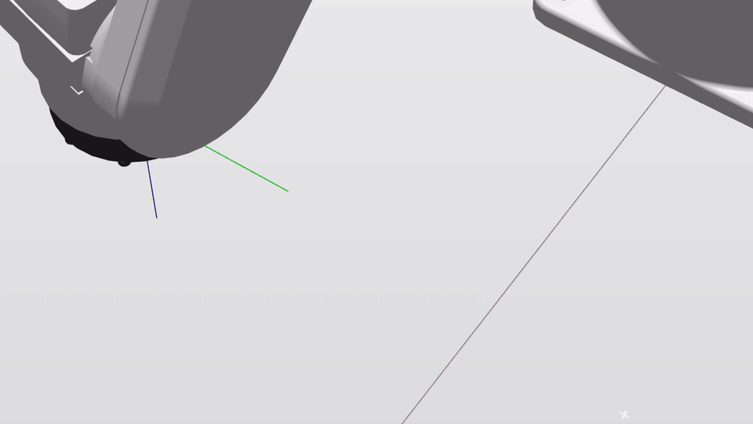
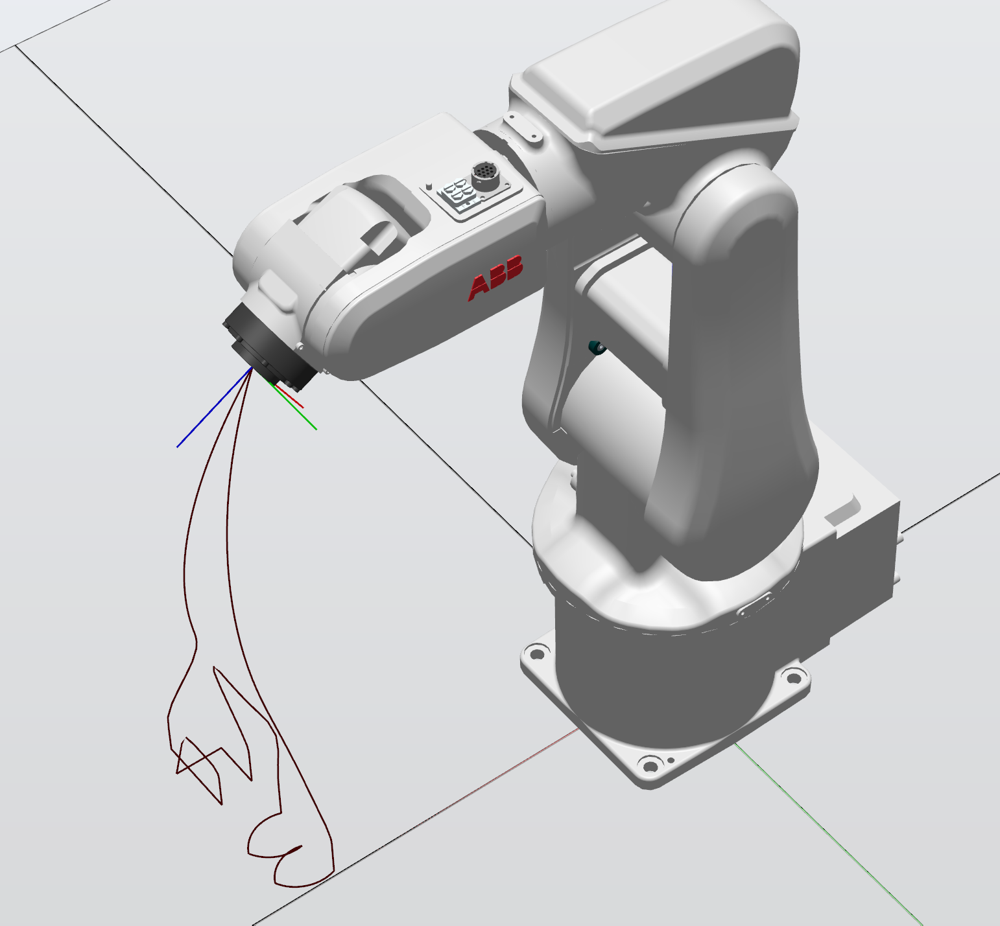
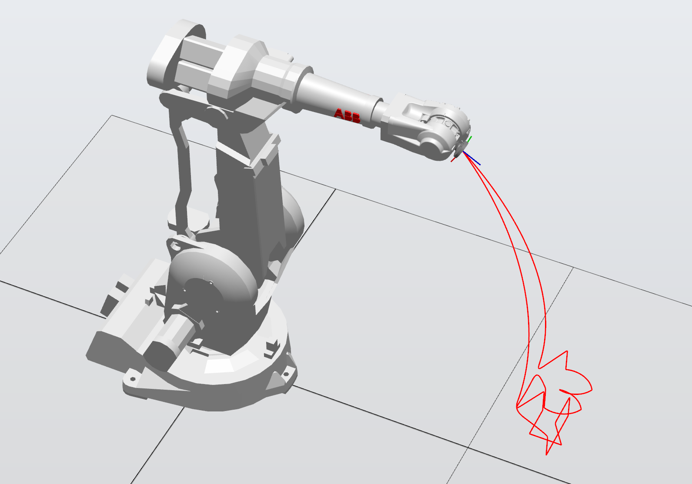
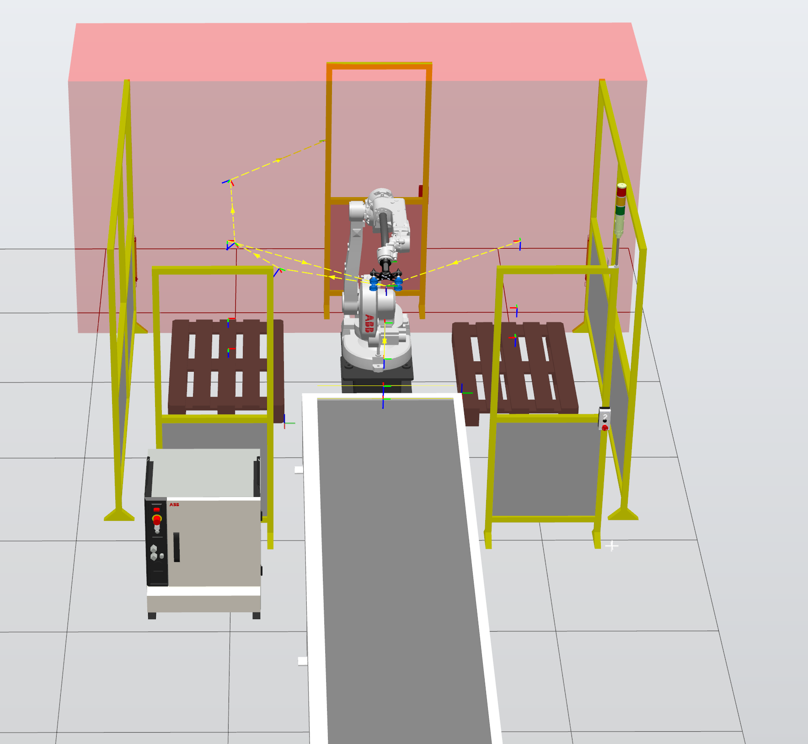
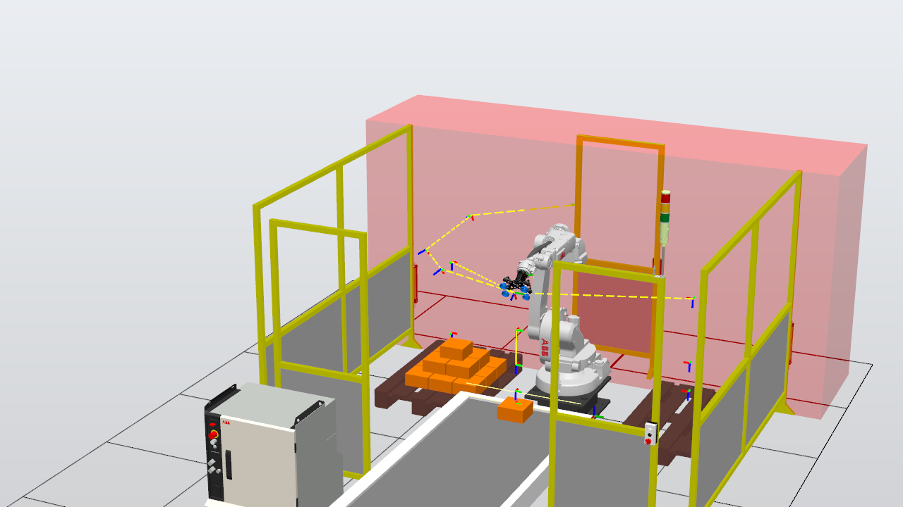

# RobotStudio Agent Bridge

[English](README.md) · [简体中文](README.zh-CN.md) · [Español](README.es.md) · [Português (Brasil)](README.pt-BR.md) · [日本語](README.ja.md) · [한국어](README.ko.md) · [Français](README.fr.md) · [Deutsch](README.de.md)

<!-- BEGIN HERO DEMO -->

[](docs/media/robotstudio-mcp-demo.mp4)

Enregistrement dans RobotStudio 2024 : un contrôleur virtuel IRB120 trace `robotstudio-mcp`. La lecture accélère progressivement de 1× à 4×, revient à 1×, puis garde le résultat à l’écran pendant 3 secondes avant de boucler.

[Voir / télécharger le MP4](docs/media/robotstudio-mcp-demo.mp4) · [Image fixe](docs/media/robotstudio-mcp-result.png)

<!-- END HERO DEMO -->

**Connectez les assistants IA à ABB RobotStudio avec des Skills, une CLI locale ou MCP.**

Inspectez une station, chargez du code RAPID, lancez une simulation et vérifiez le résultat grâce aux états, journaux et images. Ce projet de recherche repose sur un complément HTTP en C# et propose deux interfaces : une CLI Node.js autonome guidée par une Skill du dépôt, et un serveur MCP TypeScript facultatif.


<!-- BEGIN EXAMPLE SCENES -->

## Exemples de scènes

Captures originales des diapositives de soutenance du mémoire de master. Elles présentent des expériences antérieures dans RobotStudio, et non de nouveaux tests de compatibilité de la CLI ou de RobotStudio 2025/2026.

### Tracé et transfert entre robots

Les diapositives comparent le tracé de « 34 » sur IRB120 et IRB2400. Ce scénario explore la génération de mouvements RAPID, le placement du repère de travail et l’adaptation de l’échelle à un autre robot.

| IRB120 | IRB2400 |
|:---:|:---:|
|  |  |

### Prise sur convoyeur et palettisation

La cellule comporte une pince à vide, un convoyeur et deux palettes pour les expériences de prise, dépose et empilage. L’image du résultat montre la pyramide orange de 14 blocs enregistrée lors de l’expérience.

| Vue de la cellule | Résultat d’empilage enregistré |
|:---:|:---:|
|  |  |

<!-- END EXAMPLE SCENES -->

## Fonctionnalités

| Domaine | Commandes |
|---|---|
| Station et robot | `get_station_status`, `get_robot_joints` |
| Simulation et exécution | `control_simulation`, `control_rapid_execution`, `get_rapid_execution_status` |
| Code RAPID et diagnostic | `upload_rapid_module`, `get_rapid_module_source`, `list_rapid_modules`, `get_execution_errors` |
| Variables et E/S | `read_rapid_variable`, `set_rapid_variable`, `list_rapid_variables`, `get_io_signals`, `set_io_signal` |
| Scène et images | `get_scene_objects`, `get_screenshot` |

## Architecture

```text
AI agent -- Skill --> Node.js CLI ------+
                                       |
AI agent -- MCP ---> TypeScript server -+--> HTTP :8080 --> C# add-in --> ABB SDK
```

Les deux interfaces partagent le même complément et la logique du contrôleur. La CLI nécessite Node.js 18+, sans paquet npm ni enregistrement MCP. Le complément reste indispensable. La Skill décrit la procédure ; elle ne remplace pas le SDK.

## Compatibilité

| Version | État |
|---|---|
| 2024 | Version de référence, avec des expériences antérieures et une compilation locale réussie. Cette mise à jour n’a pas rejoué les essais du robot. |
| 2025 | Configuration inspirée d’Elias et LiskinLabs : .NET Framework 4.8 et assemblies de RobotStudio 2025. Ni compilation ni exécution vérifiée ici pour 2025. |
| 2026.1+ | Projet .NET 10 expérimental uniquement. Ni compilé avec le SDK 2026 ni testé en exécution. |

Les références pour 2025 sont [Elias](https://github.com/eliasbitsch/abb-robotstudio-mcp) et [LiskinLabs](https://github.com/LiskinLabs/abb-robotstudio-mcp). Consultez le [plan de compatibilité](docs/COMPATIBILITY_AND_AGENT_INTERFACES.md) pour les choix retenus et les travaux restants.

## Démarrage rapide

Sous Windows, installez RobotStudio 2024, les outils de ciblage .NET Framework 4.8, Visual Studio Build Tools/MSBuild, Node.js 18+ et NuGet CLI. Les opérations du robot nécessitent une station avec un contrôleur virtuel. Exécutez les commandes dans PowerShell.

```powershell
git clone https://github.com/zhou-zhichao/robotstudio-mcp.git
cd robotstudio-mcp
nuget install addin/packages.config -OutputDirectory addin/packages
```

### 1. Compiler et installer le complément

Fermez RobotStudio avant l’installation. Utilisez PowerShell en administrateur pour le déploiement si le dossier l’exige. La compilation génère seulement des fichiers dans `artifacts/2024` ; elle n’installe pas le complément.

```powershell
.\build.ps1
.\deploy.ps1
```

### 2. Utiliser la CLI locale / Skill

Démarrez RobotStudio, ouvrez une station avec un contrôleur virtuel et vérifiez le chargement du complément. Exécutez les commandes depuis la racine du dépôt. Choisissez un nouveau nom de fichier pour chaque capture.

```powershell
node scripts/robotstudio.mjs health
node scripts/robotstudio.mjs get_station_status
node scripts/robotstudio.mjs get_screenshot --output artifacts/view.png
```

Dans Codex, invoquez `$robotstudio` depuis ce dépôt. D’autres agents locaux peuvent lire la [Skill](.agents/skills/robotstudio/SKILL.md). Le `localhost` d’un terminal distant ou cloud n’est pas le poste exécutant RobotStudio.

### 3. Utiliser MCP (facultatif)

Compilez le serveur MCP facultatif, puis ajoutez cette définition STDIO avec le mécanisme de configuration de votre client MCP. Remplacez le chemin d’exemple par un chemin absolu sur votre poste. Le serveur MCP se connecte actuellement à `http://localhost:8080`.

```powershell
npm --prefix src install
npm --prefix src run build
```

```json
{
  "mcpServers": {
    "robotstudio": {
      "command": "node",
      "args": ["C:/path/to/robotstudio-mcp/src/dist/server.js"]
    }
  }
}
```

## Charger un module RAPID

Créez un fichier UTF-8 `params.json` avec le contenu ci-dessous et un fichier `program.mod` contenant un bloc RAPID complet `MODULE Demo ... ENDMODULE`. Cet exemple charge uniquement le module, sans lancer son exécution. `replaceExisting:false` évite le nettoyage global, mais le chargement peut échouer si le module existe déjà ou si des symboles sont en conflit.

```json
{
  "moduleName": "Demo",
  "taskName": "T_ROB1",
  "replaceExisting": false
}
```

```powershell
node scripts/robotstudio.mjs upload_rapid_module --params-file params.json --code-file program.mod
```

## Options de la CLI

| Option | Comportement |
|---|---|
| `--params-file` | Lit les arguments dans un fichier JSON UTF-8. |
| `--code-file` | Lit le code RAPID dans un fichier en conservant les guillemets. Chargement uniquement. |
| `--output` | Enregistre du JSON ou un PNG sans écraser de fichier. Obligatoire pour les captures. |
| `--url / ROBOTSTUDIO_API_BASE` | Choisit l’origine HTTP du complément. Par défaut : `http://127.0.0.1:8080`. |
| `--timeout` | Délai maximal en millisecondes (1–300000). |
| `--help / --describe` | Affiche les commandes ou la définition exacte des paramètres. |

Les résultats corrects sont écrits en JSON sur stdout. Les erreurs sont écrites en JSON sur stderr avec un code de sortie non nul. Ouvrez le chemin absolu du PNG retourné dans une visionneuse ou l’outil d’image de l’agent.

```powershell
node scripts/robotstudio.mjs --help
node scripts/robotstudio.mjs --describe upload_rapid_module
```

## Comportements à connaître

- Sauvegardez les modules concernés avant remplacement. Par défaut, `replaceExisting:true` tente de supprimer les modules de la tâche sauf ceux nommés `BASE` ou `user`, pas seulement le module demandé. Aucun retour arrière automatique n’est fourni.
- La réinitialisation de simulation inclut un nettoyage de boîtes propre à la démonstration, pas une restauration complète de la station.
- Les positions et dimensions brutes de scène de la CLI sont en mètres ; MCP peut les convertir en millimètres. Vérifiez les unités.
- Une écriture peut avoir été appliquée malgré un dépassement de délai. Vérifiez l’état avant de réessayer ; la CLI ne réessaie pas automatiquement.
- Le projet prend pour référence la simulation avec contrôleur virtuel. Les tests actuels ne démontrent pas son adéquation au matériel réel.

## Compiler pour une autre version

Choisissez explicitement l’année ; la valeur par défaut reste 2024. `-RobotStudioBin` indique le SDK et `-MSBuildPath` le compilateur Framework. Le déploiement vérifie les métadonnées ; `-WhatIf` prévisualise l’installation et exige une compilation réussie.

```powershell
.\build.ps1 -RobotStudioVersion 2025 -RobotStudioBin 'C:\Program Files (x86)\ABB\RobotStudio 2025\Bin'
.\deploy.ps1 -RobotStudioVersion 2025 -WhatIf
```

2026 exige également les assemblies SDK .NET 10 correspondantes, les outils de développement .NET 10 et `-Experimental` pour la compilation comme pour le déploiement. Changer seulement l’année ne suffit pas à migrer.

## Validation

Sept tests HTTP/CLI simulés, la validation de la Skill, la compilation TypeScript et la compilation du complément 2024 ont réussi. Les tests ci-dessous ne pilotent pas RobotStudio. Des avertissements d’API obsolètes de simulation/Mastership subsistent ; la vérification sur 2025/2026 reste à faire.

```powershell
node --test tests/robotstudio-cli.test.mjs
npm --prefix src run build
```

## Documentation et code source

- [Procédure de travail](.agents/skills/robotstudio/SKILL.md)
- [Exemples RAPID](docs/RAPID_EXAMPLES.md)
- [Référence HTTP](docs/HTTP_API.md)
- [Compatibilité et interfaces](docs/COMPATIBILITY_AND_AGENT_INTERFACES.md)
- [Historique des expériences et échecs](docs/DEVELOPMENT_LOG.md)
- [Implémentation CLI](scripts/robotstudio.mjs)
- [Complément C#](addin/RobotStudioAddin.cs)

## Licence

MIT, selon la déclaration du projet.
