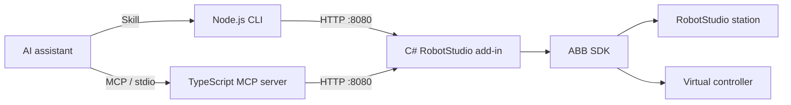

# RobotStudio Agent Bridge

[English](README.md) · [简体中文](README.zh-CN.md) · [Español](README.es.md) · [Português (Brasil)](README.pt-BR.md) · [日本語](README.ja.md) · [한국어](README.ko.md) · [Français](README.fr.md) · [Deutsch](README.de.md)

<!-- BEGIN HERO DEMO -->

[](docs/media/robotstudio-mcp-demo.mp4)

Recorded in RobotStudio 2024: an IRB120 virtual controller draws `robotstudio-mcp`.

[Watch / download MP4](docs/media/robotstudio-mcp-demo.mp4) · [Still image](docs/media/robotstudio-mcp-result.png)

<!-- END HERO DEMO -->

**Connect AI assistants to ABB RobotStudio through Skills, a local CLI or MCP.**

Inspect a station, upload RAPID source, run a simulation and read back what happened. This research project provides one C# HTTP add-in with two agent interfaces: a standalone Node.js CLI guided by a repository Skill, and an optional TypeScript MCP server.


<!-- BEGIN EXAMPLE SCENES -->

## Example scenes

### Drawing and cross-robot transfer

The slides compare the “34” drawing task on IRB120 and IRB2400. This scenario exercises RAPID motion generation, work-object placement and adapting the drawing scale to another robot.

| IRB120 | IRB2400 |
|:---:|:---:|
|  |  |

### Conveyor pick-and-place and palletizing

A vacuum-gripper cell with a conveyor and two pallets supports pick-and-place and stacking experiments. The result image shows the recorded 14-block orange pyramid.

| Cell layout | Recorded stacking result |
|:---:|:---:|
|  |  |

<!-- END EXAMPLE SCENES -->

## What you can do

| Area | Commands |
|---|---|
| Station and robot | `get_station_status`, `get_robot_joints` |
| Simulation and execution | `control_simulation`, `control_rapid_execution`, `get_rapid_execution_status` |
| RAPID source and diagnostics | `upload_rapid_module`, `get_rapid_module_source`, `list_rapid_modules`, `get_execution_errors` |
| Variables and I/O | `read_rapid_variable`, `set_rapid_variable`, `list_rapid_variables`, `get_io_signals`, `set_io_signal` |
| Scene and images | `get_scene_objects`, `get_screenshot` |
| TCP pose | `get_robot_pose` |
| Speed control | `get_speed_settings`, `set_simulation_speed`, `set_speed_override` |
| Save and restore | `save_station`, `save_rapid_program`, `list_rapid_backups`, `load_rapid_program` |
| Paths and targets | `get_paths`, `get_path_targets`, `create_path`, `create_target`, `append_path_target` |
| Program checks | `validate_rapid`, `check_execution_ready` |
| Controller files | `read_controller_config`, `list_controller_files`, `read_controller_file` |


The MCP server now exposes 34 tools. The 18 additions are also available through the CLI and Skill; see the [parameter and workflow reference](docs/EXTENDED_TOOLS.md). New SDK operations compile against RobotStudio 2024; in-host validation is pending.

## Architecture



Both interfaces share the same add-in and controller behavior. The CLI needs Node.js 18+ but no npm packages or MCP registration. The add-in is still required. The repository Skill describes the workflow; it does not replace the SDK.

## Compatibility

| Version | Status |
|---|---|
| 2024 | Existing baseline; historical experiments and a successful local build. This update did not rerun robot workflows. |
| 2025 | Configuration based on Elias and LiskinLabs: .NET Framework 4.8 and 2025 host assemblies. Not built or runtime-tested here. |
| 2026.1+ | Experimental .NET 10 project only. Not compiled against the 2026 SDK or runtime-tested. |

The 2025 reference implementations are [Elias](https://github.com/eliasbitsch/abb-robotstudio-mcp) and [LiskinLabs](https://github.com/LiskinLabs/abb-robotstudio-mcp). See the [compatibility plan](docs/COMPATIBILITY_AND_AGENT_INTERFACES.md) for the adopted design and remaining work.

## Quick start

On Windows, install RobotStudio 2024, the .NET Framework 4.8 targeting tools, Visual Studio Build Tools/MSBuild, Node.js 18+ and NuGet CLI. A station with a virtual controller is required for robot operations. Run the following commands in PowerShell.

```powershell
git clone https://github.com/zhou-zhichao/robotstudio-mcp.git
cd robotstudio-mcp
nuget install addin/packages.config -OutputDirectory addin/packages
```

### 1. Build and install the add-in

Close RobotStudio before installation. Run deployment from an administrator PowerShell if the installation directory requires it. Building only creates files in `artifacts/2024`; it does not install the add-in.

```powershell
.\build.ps1
.\deploy.ps1
```

### 2. Connect through the local CLI / Skill

Start RobotStudio, open a station with a virtual controller, and check that the add-in loads. Run these commands from the repository root. Choose a new screenshot filename for each capture.

```powershell
node scripts/robotstudio.mjs health
node scripts/robotstudio.mjs get_station_status
node scripts/robotstudio.mjs get_screenshot --output artifacts/view.png
```

In Codex, invoke `$robotstudio` from this repository. The [repository Skill](.agents/skills/robotstudio/SKILL.md) is also readable by other local agents. A remote/cloud shell cannot reach the workstation through its own `localhost`.

### 3. Use MCP instead (optional)

Build the optional MCP server, then add the following STDIO server definition using your MCP client’s configuration mechanism. Replace the example path with the absolute path on your machine. The MCP server currently connects to `http://localhost:8080`.

```powershell
npm --prefix src install
npm --prefix src run build
```

```json
{
  "mcpServers": {
    "robotstudio": {
      "command": "node",
      "args": ["C:/path/to/robotstudio-mcp/src/dist/server.js"]
    }
  }
}
```

## Upload a RAPID module

Create a UTF-8 `params.json` file as shown below and a complete RAPID `MODULE Demo ... ENDMODULE` source file named `program.mod`. This example uploads only; it does not start execution. `replaceExisting:false` avoids the broad cleanup path and may fail if a module already exists or symbols conflict.

```json
{
  "moduleName": "Demo",
  "taskName": "T_ROB1",
  "replaceExisting": false
}
```

```powershell
node scripts/robotstudio.mjs upload_rapid_module --params-file params.json --code-file program.mod
```

## CLI options

| Option | Behavior |
|---|---|
| `--params-file` | Read arguments from a UTF-8 JSON file. |
| `--code-file` | Read RAPID source from a file, preserving quoting. Upload only. |
| `--output` | Save JSON, or PNG for screenshots; never overwrite. Required for screenshots. |
| `--url / ROBOTSTUDIO_API_BASE` | Select the add-in HTTP origin. Default: `http://127.0.0.1:8080`. |
| `--timeout` | Request timeout in milliseconds (1–300000). |
| `--help / --describe` | Show commands or the exact parameter contract. |

Successful results go to stdout as JSON. Failures go to stderr as JSON with a nonzero exit code. Open the returned PNG path with an image viewer or the agent’s image tool.

```powershell
node scripts/robotstudio.mjs --help
node scripts/robotstudio.mjs --describe upload_rapid_module
```

## Important behavior

- Back up affected modules before replacement. The default `replaceExisting:true` cleanup attempts to delete modules in the selected task except those named `BASE` or `user`; it is not limited to the requested module. No automatic rollback is provided.
- Simulation reset contains demo-specific box cleanup, not a complete station restore.
- Raw CLI scene positions and bounds use meters; MCP output may convert them to millimeters. Verify units before calculating positions.
- A timed-out write may have taken effect. Inspect state before retrying; the CLI does not automatically retry.
- This project’s baseline is virtual-controller simulation. Current tests do not establish suitability for real hardware.

## Build for another version

Select the year explicitly; 2024 remains the default. `-RobotStudioBin` overrides SDK discovery and `-MSBuildPath` selects the Framework compiler. Deployment checks build metadata. `-WhatIf` previews installation and requires a successful build first.

```powershell
.\build.ps1 -RobotStudioVersion 2025 -RobotStudioBin 'C:\Program Files (x86)\ABB\RobotStudio 2025\Bin'
.\deploy.ps1 -RobotStudioVersion 2025 -WhatIf
```

2026 additionally requires matching .NET 10 SDK assemblies, the .NET 10 development toolchain and `-Experimental` for both build and deployment. Changing the year alone does not complete the migration.

## Validation

Seven mock HTTP/CLI tests, Skill format validation, TypeScript compilation and the 2024 add-in build passed during the implementation review. The tests below do not drive RobotStudio. Deprecated simulation/Mastership API warnings remain; 2025/2026 host verification is outstanding.

```powershell
node --test tests/robotstudio-cli.test.mjs
npm --prefix src run build
```

## Documentation and source

- [Workflow instructions](.agents/skills/robotstudio/SKILL.md)
- [RAPID examples](docs/RAPID_EXAMPLES.md)
- [HTTP endpoint reference](docs/HTTP_API.md)
- [Compatibility and interface design](docs/COMPATIBILITY_AND_AGENT_INTERFACES.md)
- [Experiment history, including failures](docs/DEVELOPMENT_LOG.md)
- [CLI implementation](scripts/robotstudio.mjs)
- [C# add-in](addin/RobotStudioAddin.cs)

## Acknowledgments

Thanks to [Elias Bitsch](https://github.com/eliasbitsch/abb-robotstudio-mcp) and [LiskinLabs](https://github.com/LiskinLabs/abb-robotstudio-mcp) for their open-source RobotStudio MCP implementations. Their TCP, speed, station/path, program-management and precheck tools informed this extension. Our implementation uses the shared C# / HTTP layer for both MCP and CLI, with ABB SDK documentation as the API reference.

## License

Licensed under the [MIT License](LICENSE).
