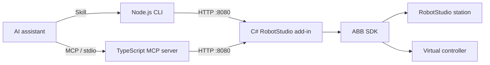

# RobotStudio Agent Bridge

[English](README.md) · [简体中文](README.zh-CN.md) · [Español](README.es.md) · [Português (Brasil)](README.pt-BR.md) · [日本語](README.ja.md) · [한국어](README.ko.md) · [Français](README.fr.md) · [Deutsch](README.de.md)

<!-- BEGIN HERO DEMO -->

[](docs/media/robotstudio-mcp-demo.mp4)

Gravação no RobotStudio 2024: um controlador virtual IRB120 desenha `robotstudio-mcp`.

[Assistir / baixar MP4](docs/media/robotstudio-mcp-demo.mp4) · [Imagem estática](docs/media/robotstudio-mcp-result.png)

<!-- END HERO DEMO -->

**Conecte assistentes de IA ao ABB RobotStudio por Skills, CLI local ou MCP.**

Inspecione uma estação, envie código RAPID, execute uma simulação e confira o resultado por estados, logs e imagens. Este projeto de pesquisa oferece um suplemento HTTP em C# e duas interfaces: uma CLI independente em Node.js orientada por uma Skill do repositório e um servidor MCP opcional em TypeScript.


<!-- BEGIN EXAMPLE SCENES -->

## Cenários de exemplo

### Desenho e transferência entre robôs

Os slides comparam o desenho de “34” no IRB120 e no IRB2400. O cenário explora a geração de movimentos RAPID, o posicionamento do objeto de trabalho e o ajuste da escala para outro robô.

| IRB120 | IRB2400 |
|:---:|:---:|
|  |  |

### Coleta na esteira e paletização

A célula tem uma garra a vácuo, uma esteira e dois paletes para experimentos de coleta, posicionamento e empilhamento. A imagem do resultado mostra a pirâmide laranja de 14 blocos registrada no experimento.

| Visão da célula | Resultado de empilhamento registrado |
|:---:|:---:|
|  |  |

<!-- END EXAMPLE SCENES -->

<!-- BEGIN COMMUNITY SCENARIOS -->

## Cenários da comunidade e agradecimentos

Estações de terceiros para explorar. O [catálogo](docs/COMMUNITY_SCENES.md) reúne os pacotes, versões e detalhes do traçado de escrita. Estas estações ainda não foram testadas com esta ponte. Agradecemos aos autores:

- **Linha de separação com dois robôs** — [rparak/ABB-RobotStudio-SortingProductionLine](https://github.com/rparak/ABB-RobotStudio-SortingProductionLine).
- **Torre de Hanói com YuMi** — [rparak/ABB-RobotStudio-YUMI-Tower-of_Hanoi](https://github.com/rparak/ABB-RobotStudio-YUMI-Tower-of_Hanoi).
- **Montagem e soldagem simulada com dois IRB2600** — [jorgeserranoo/abb-irb2600-robotic-assembly-cell](https://github.com/jorgeserranoo/abb-irb2600-robotic-assembly-cell).
- **Separação e empilhamento com IRB360 FlexPicker** — [andyzaur/ConveyorBelt-FlexPicker](https://github.com/andyzaur/ConveyorBelt-FlexPicker).
- **Escrita cursiva Hershey** — [FLo-ABB/Hershey-ABB-Robot-Handwriting](https://github.com/FLo-ABB/Hershey-ABB-Robot-Handwriting).

<!-- END COMMUNITY SCENARIOS -->

## Recursos

| Área | Comandos |
|---|---|
| Estação e robô | `get_station_status`, `get_robot_joints` |
| Simulação e execução | `control_simulation`, `control_rapid_execution`, `get_rapid_execution_status` |
| Código RAPID e diagnóstico | `upload_rapid_module`, `get_rapid_module_source`, `list_rapid_modules`, `get_execution_errors` |
| Variáveis e E/S | `read_rapid_variable`, `set_rapid_variable`, `list_rapid_variables`, `get_io_signals`, `set_io_signal` |
| Cena e imagens | `get_scene_objects`, `get_screenshot` |
| Pose TCP | `get_robot_pose` |
| Controle de velocidade | `get_speed_settings`, `set_simulation_speed`, `set_speed_override` |
| Salvar e restaurar | `save_station`, `save_rapid_program`, `list_rapid_backups`, `load_rapid_program` |
| Trajetórias e pontos | `get_paths`, `get_path_targets`, `create_path`, `create_target`, `append_path_target` |
| Verificação do programa | `validate_rapid`, `check_execution_ready` |
| Arquivos do controlador | `read_controller_config`, `list_controller_files`, `read_controller_file` |


O servidor MCP oferece 34 ferramentas. As 18 novas também estão disponíveis pela CLI e Skill; consulte a [referência de parâmetros e fluxos](docs/EXTENDED_TOOLS.md). As novas operações SDK compilam com o RobotStudio 2024; a validação dentro do aplicativo ainda está pendente.

## Arquitetura



As duas interfaces compartilham o suplemento e a lógica do controlador. A CLI exige Node.js 18+, sem pacotes npm nem cadastro de MCP. O suplemento continua necessário. A Skill descreve o fluxo de trabalho; não substitui o SDK.

## Compatibilidade

| Versão | Estado |
|---|---|
| 2024 | Base atual, com experimentos anteriores e compilação local bem-sucedida. Esta atualização não repetiu os testes do robô. |
| 2025 | Configuração baseada em Elias e LiskinLabs: .NET Framework 4.8 e assemblies do RobotStudio 2025. Sem compilação ou teste de execução próprio para 2025. |
| 2026.1+ | Apenas um projeto experimental .NET 10. Não compilado com o SDK 2026 nem testado em execução. |

As referências para 2025 são [Elias](https://github.com/eliasbitsch/abb-robotstudio-mcp) e [LiskinLabs](https://github.com/LiskinLabs/abb-robotstudio-mcp). Veja o [plano de compatibilidade](docs/COMPATIBILITY_AND_AGENT_INTERFACES.md) para o projeto adotado e as tarefas pendentes.

## Início rápido

No Windows, instale RobotStudio 2024, as ferramentas de destino do .NET Framework 4.8, Visual Studio Build Tools/MSBuild, Node.js 18+ e NuGet CLI. Operações do robô exigem uma estação com controlador virtual. Execute os comandos no PowerShell.

```powershell
git clone https://github.com/zhou-zhichao/robotstudio-mcp.git
cd robotstudio-mcp
nuget install addin/packages.config -OutputDirectory addin/packages
```

### 1. Compilar e instalar o suplemento

Feche o RobotStudio antes de instalar. Execute a implantação em um PowerShell como administrador se a pasta exigir. A compilação apenas gera arquivos em `artifacts/2024`; não instala o suplemento.

```powershell
.\build.ps1
.\deploy.ps1
```

### 2. Usar a CLI local / Skill

Inicie o RobotStudio, abra uma estação com controlador virtual e confirme que o suplemento foi carregado. Execute os comandos na raiz do repositório. Use um nome de arquivo novo para cada captura.

```powershell
node scripts/robotstudio.mjs health
node scripts/robotstudio.mjs get_station_status
node scripts/robotstudio.mjs get_screenshot --output artifacts/view.png
```

No Codex, invoque `$robotstudio` neste repositório. Outros agentes locais podem ler a [Skill](.agents/skills/robotstudio/SKILL.md). O `localhost` de um terminal remoto ou na nuvem não é o computador que executa o RobotStudio.

### 3. Usar MCP (opcional)

Compile o servidor MCP opcional e adicione esta definição STDIO pelo mecanismo de configuração do seu cliente MCP. Substitua o caminho de exemplo pelo caminho absoluto no seu computador. O servidor MCP atualmente se conecta a `http://localhost:8080`.

```powershell
npm --prefix src install
npm --prefix src run build
```

```json
{
  "mcpServers": {
    "robotstudio": {
      "command": "node",
      "args": ["C:/path/to/robotstudio-mcp/src/dist/server.js"]
    }
  }
}
```

## Enviar um módulo RAPID

Crie `params.json` em UTF-8 com o conteúdo abaixo e um arquivo `program.mod` com um bloco RAPID completo `MODULE Demo ... ENDMODULE`. O exemplo apenas envia o módulo; não inicia a execução. `replaceExisting:false` evita a limpeza ampla, mas o envio pode falhar se o módulo já existir ou houver conflito de símbolos.

```json
{
  "moduleName": "Demo",
  "taskName": "T_ROB1",
  "replaceExisting": false
}
```

```powershell
node scripts/robotstudio.mjs upload_rapid_module --params-file params.json --code-file program.mod
```

## Opções da CLI

| Opção | Comportamento |
|---|---|
| `--params-file` | Lê argumentos de um arquivo JSON UTF-8. |
| `--code-file` | Lê código RAPID de um arquivo, preservando aspas. Apenas para envio. |
| `--output` | Salva JSON ou PNG, sem sobrescrever. Obrigatório para capturas. |
| `--url / ROBOTSTUDIO_API_BASE` | Seleciona a origem HTTP do suplemento. Padrão: `http://127.0.0.1:8080`. |
| `--timeout` | Tempo limite em milissegundos (1–300000). |
| `--help / --describe` | Exibe os comandos ou a definição exata dos parâmetros. |

Resultados bem-sucedidos são enviados como JSON para stdout. Falhas geram JSON em stderr e código de saída diferente de zero. Abra o caminho PNG retornado em um visualizador ou na ferramenta de imagem do agente.

```powershell
node scripts/robotstudio.mjs --help
node scripts/robotstudio.mjs --describe upload_rapid_module
```

## Comportamentos importantes

- Faça backup dos módulos afetados antes de substituir. O padrão `replaceExisting:true` tenta excluir os módulos da tarefa, exceto os chamados `BASE` ou `user`, não apenas o módulo indicado. Não há reversão automática.
- O reset da simulação inclui limpeza de caixas específica da demonstração; não restaura toda a estação.
- Posições e dimensões de cena retornadas pela CLI usam metros; o MCP pode convertê-las para milímetros. Confira as unidades.
- Uma escrita pode ter sido aplicada mesmo após um timeout. Verifique o estado antes de repetir; a CLI não faz novas tentativas automaticamente.
- A base do projeto é a simulação com controlador virtual. Os testes atuais não comprovam adequação para hardware real.

## Compilar para outra versão

Escolha o ano explicitamente; o padrão continua sendo 2024. `-RobotStudioBin` define o SDK e `-MSBuildPath` o compilador Framework. A implantação verifica os metadados; `-WhatIf` mostra uma prévia e exige uma compilação bem-sucedida.

```powershell
.\build.ps1 -RobotStudioVersion 2025 -RobotStudioBin 'C:\Program Files (x86)\ABB\RobotStudio 2025\Bin'
.\deploy.ps1 -RobotStudioVersion 2025 -WhatIf
```

2026 também exige assemblies SDK .NET 10 correspondentes, ferramentas de desenvolvimento .NET 10 e `-Experimental` na compilação e na implantação. Alterar apenas o ano não conclui a migração.

## Validação

Passaram sete testes HTTP/CLI simulados, a validação da Skill, a compilação TypeScript e a compilação do suplemento 2024. Os testes abaixo não controlam o RobotStudio. Permanecem avisos de APIs obsoletas de simulação/Mastership; falta verificar 2025/2026 no aplicativo.

```powershell
node --test tests/robotstudio-cli.test.mjs
npm --prefix src run build
```

## Documentação e código

- [Fluxo de trabalho](.agents/skills/robotstudio/SKILL.md)
- [Exemplos RAPID](docs/RAPID_EXAMPLES.md)
- [Referência HTTP](docs/HTTP_API.md)
- [Compatibilidade e interfaces](docs/COMPATIBILITY_AND_AGENT_INTERFACES.md)
- [Histórico de experimentos e falhas](docs/DEVELOPMENT_LOG.md)
- [Implementação CLI](scripts/robotstudio.mjs)
- [Suplemento C#](addin/RobotStudioAddin.cs)

## Agradecimentos

Agradecemos a [Elias Bitsch](https://github.com/eliasbitsch/abb-robotstudio-mcp) e à [LiskinLabs](https://github.com/LiskinLabs/abb-robotstudio-mcp) por suas implementações abertas de RobotStudio MCP. As ferramentas de TCP, velocidade, trajetórias, gestão de programas e verificação prévia inspiraram esta extensão, implementada na camada C# / HTTP compartilhada com base na documentação do SDK da ABB.

## Licença

Este projeto é distribuído sob a [licença MIT](LICENSE).
