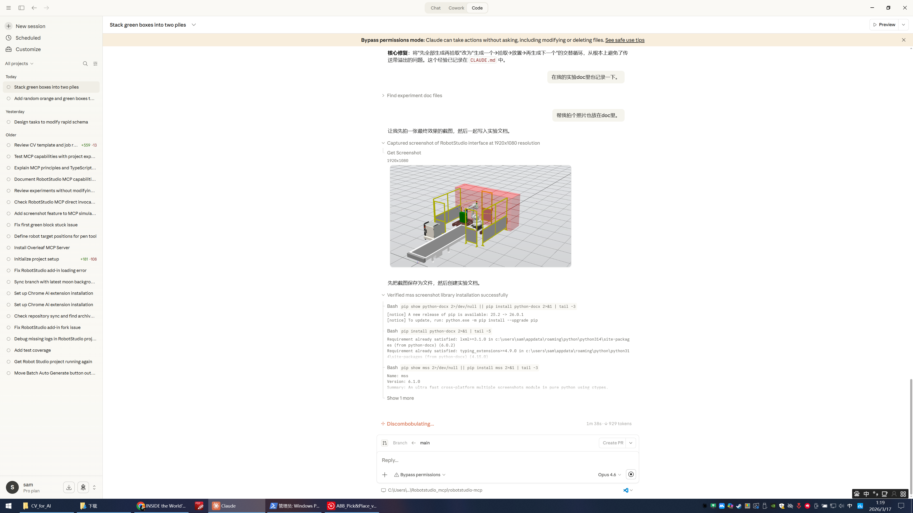
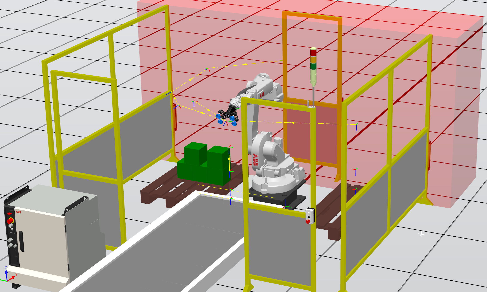

# Development Log

This is an honest record of building the RobotStudio MCP Server Bridge. It was developed iteratively by a human operator and Claude (Anthropic AI, model claude-opus-4-6) working together through Claude Code. Every failure, wrong assumption, and debugging detour is documented here — because that's what real development looks like.

## Timeline

### Session 1: Initial Setup (commit `3c51d1c`)

The original codebase came from a forked repo. It had the basic C# add-in structure and TypeScript MCP server, but nothing worked yet. The add-in wouldn't load in RobotStudio.

### Session 2: Fixing the Add-in Loading Failure (commit `cb973fa`)

**Problem:** The add-in showed an X mark in RobotStudio's Add-Ins manager — it failed to load silently with no useful error messages.

**Debugging journey:**

This took multiple iterations because RobotStudio gives almost zero diagnostic information when an add-in fails. Each attempt required: edit code → build → close RobotStudio → deploy DLL → reopen RobotStudio → check if the X is gone.

**Failure 1: HttpListener needs admin privileges**

The original code used `System.Net.HttpListener` to serve the REST API. On Windows, `HttpListener` requires URL ACL registration (`netsh http add urlacl`) for non-admin processes. RobotStudio runs as a normal user, so `HttpListener.Start()` throws `HttpListenerException` (Access Denied). The add-in catches this silently and fails to initialize.

> I (Claude) initially didn't realize this was the issue. I was looking at manifest problems and SDK reference issues first. The actual fix was replacing `HttpListener` with `System.Net.Sockets.TcpListener`, which can bind to `127.0.0.1` without special permissions. This meant writing a manual HTTP parser — reading request lines, headers, and body from raw TCP streams.

**Failure 2: Wrong deployment path**

We initially deployed to `%LocalAppData%\ABB\RobotStudio\Addins\` because some documentation suggested this path. RobotStudio completely ignored it. It only scans:
```
C:\Program Files (x86)\ABB\RobotStudio 2024\Bin\Addins\
```

**Failure 3: C# language version**

The .csproj targets .NET Framework 4.8, and when building with `C:\Windows\Microsoft.NET\Framework64\v4.0.30319\MSBuild.exe`, the C# compiler is version 5. I kept writing C# 6+ features (`?.`, `$""`, `out var`, `catch when`) and the build kept failing with cryptic syntax errors. Had to rewrite everything in C# 5 style:
- `?.` → explicit null checks
- `$"..."` → `string.Concat()` or `+`
- `out var x` → declare `x` separately
- `catch when (...)` → `if` inside `catch`

**Failure 4: rsaddin manifest**

The `.rsaddin` XML manifest needed `<Dependencies>Online</Dependencies>` (not `None` or `Station`) and `<Platform>Any</Platform>` to match what RobotStudio expects. Found this by examining the manifest format of official ABB add-ins.

**Resolution:** After fixing all four issues, the add-in loaded successfully (green checkmark) and the HTTP server started on port 8080.

---

### Session 3: Adding RAPID Upload & Execution (commit `91fd502`)

Added 4 new MCP tools and 4 new HTTP endpoints for RAPID program management. The C# side required understanding the ABB RobotStudio SDK's RAPID domain API. The TypeScript side was straightforward — just bridging HTTP calls.

This session was mostly successful, but the real testing happened in Session 4.

---

### Session 4: The RAPID Upload Debugging Marathon (commit `e780d0f`)

This was the hardest part. What should have been a simple "upload code and run" turned into 5+ hours of debugging. Here's every failure in order:

**Failure 1: Generic exception with no details**

First upload attempt returned: `"Exception of type 'System.Exception' was thrown."` — the most useless error message possible.

Root cause: Missing `controller.Logon(UserInfo.DefaultUser)`. The ABB SDK requires explicit authentication even for local virtual controllers. Without login, all write operations fail with a generic exception.

Fix: Added `controller.Logon(UserInfo.DefaultUser)` after `Controller.Connect()`. Also wrapped each step in separate try-catch blocks to get better error localization.

**Failure 2: PutFile doesn't work on virtual controllers**

After fixing the login, the next error was `PutFile` failing. The code was doing:
```csharp
controller.FileSystem.PutFile(tempFile, controllerFilePath, true);
```

This works on real robot controllers over network, but on virtual controllers, the HOME path is just a local Windows directory like:
```
C:/Users/sam/Documents/RobotStudio/Projects/Project7/Virtual Controllers/IRB120_3_58/HOME/
```

Fix: Replaced `PutFile()` with `File.Copy()`. Since `GetEnvironmentVariable("HOME")` returns a local path for virtual controllers, we can just copy files directly.

**Failure 3: UTF-8 BOM kills RAPID parser**

The .mod file uploaded successfully to the HOME directory, but the controller rejected it with a syntax error. After much head-scratching, I (Claude) checked the file in hex and found the first 3 bytes were `EF BB BF` — the UTF-8 BOM (Byte Order Mark).

The RAPID parser does NOT accept BOM. It treats those bytes as invalid characters at the start of the file.

Root cause: In C#, `Encoding.UTF8` includes BOM by default. You have to explicitly create `new UTF8Encoding(false)` to suppress it.

Also found that `\n` (LF) line endings cause issues — RAPID expects `\r\n` (CRLF). Added normalization:
```csharp
string normalizedCode = request.Code.Replace("\r\n", "\n").Replace("\n", "\r\n");
File.WriteAllText(tempFile, normalizedCode, new UTF8Encoding(false));
```

**Failure 4: "Global routine name main ambiguous"**

After fixing encoding, the module loaded but the program check reported errors. The human operator sent a screenshot showing TWO modules under T_ROB1 Program Modules — both `McpTest` (from an earlier failed attempt) and `Module1`, each containing a `main()` procedure.

First fix attempt: Delete the same-name module before loading:
```csharp
rapidTask.GetModule(moduleName).Delete();
```

This didn't help because the stale module had a DIFFERENT name (`McpTest` vs `Module1`).

Final fix: Delete ALL program modules before loading:
```csharp
Module[] modules = rapidTask.GetModules();
for (int m = 0; m < modules.Length; m++)
{
    string mName = modules[m].Name;
    if (mName == "BASE" || mName == "user")
        continue;  // keep system modules
    modules[m].Delete();
}
```

**Failure 5: ModuleType enum not found**

Initially tried to filter modules by type (`modules[m].Type == ModuleType.Program`), but the `ModuleType` enum isn't exposed in the referenced SDK assemblies. Changed to name-based filtering: skip "BASE" and "user" (case-insensitive), delete everything else.

**Finally working!**

After all these fixes, the full cycle worked:
```
upload → resetpp → start → (robot moves) → status: Stopped
```

The test program moved the IRB120 through three joint positions and returned to home. Joint readback confirmed the motion was correct.

---

### Session 5: PPU055 Lab Exercise Adaptation

The human operator wanted to implement a university lab exercise (PPU055 "Robotised Engraving" for IRB1400) on an IRB120 robot using the MCP tools.

**Phase 1: Understanding the exercise**

Read a 22-page PDF describing the lab. Key requirements:
- Draw a logo on paper within 80x80mm square
- Use MoveL and MoveC (at least one circular arc)
- ~20 target positions
- v100 speed on paper, pen perpendicular, 40mm above when not drawing

**Phase 2: Single pattern — Success**

Designed a star+circle pattern (5-pointed star inside a circle). First test at z=200mm with work object at [400, 0, 200] — worked perfectly on the first try. The robot traced the star (5 MoveL segments) and circle (4 MoveC quarter-arcs) smoothly.

**Phase 3: Dual pattern — Multiple failures**

The operator asked for two patterns on the ground, 180 degrees apart. This is where things got interesting.

**Failure 1: Wrist singularity at ground level (z=0)**

Moved the work objects to z=0 (ground level). Error: "Close to singularity". When the tool points straight down (`[0, 0, 1, 0]`) and the robot reaches to the ground, J5 approaches 0 degrees — the wrist singularity point.

**Failure 2: SingArea \Wrist made it worse**

Added `SingArea \Wrist;` to handle the singularity. New error: "Joint Out of Range — rob1_4 out of working range". The singularity avoidance algorithm causes J4 and J6 to spin rapidly in opposite directions, and J4 exceeded its ±160 degree limit.

**Failure 3: Tilting the tool orientation didn't help enough**

Changed tool orientation from `[0, 0, 1, 0]` (straight down) to `[0.131, 0, 0.991, 0]` (15 degrees tilt from vertical). Still got J4 out of range. The tilt wasn't enough to move J5 away from the singularity zone.

**Failure 4: Raising to z=100 — still failed**

Even at z=100mm (not ground level), the same J4 error occurred. The SingArea instruction was the main culprit.

**Failure 5: z=200 with rotated wobj — still failed!**

This was surprising. Went back to z=200 (which worked for the single pattern), removed SingArea, but added wobj rotation for the 180-degree-opposite pattern. Error: J4 out of range.

Root cause: The second work object was rotated 180 degrees about Z (`orientation: [0, 0, 0, 1]`). This caused the tool orientation in world frame to change from "180 about Y" to "180 about X" — a completely different wrist configuration requiring J4 to rotate ~180 degrees to transition, exceeding ±160 degree limits.

**Failure 6: Even without rotation — still failed!**

Changed both work objects to identity orientation (no rotation), just offset in Y. STILL failed with J4 out of range.

Root cause discovery: Checked the joint positions and found J4=159.43 degrees, J5=2.7 degrees. The robot was STUCK in a bad configuration from the previous failed run! Every subsequent program start tried to move from this bad position, immediately hitting the J4 limit.

**Final fix: MoveAbsJ to home first**

Added `MoveAbsJ [[0, 0, 0, 0, 30, 0], ...], v200, fine, tool0;` as the very first instruction. This moves the robot to a safe home position using joint-space interpolation (no Cartesian path, no singularity issues) before doing anything else.

Both patterns then executed successfully.

**Key lesson:** After a failed run leaves the robot in an unknown/bad configuration, you MUST start the next program with MoveAbsJ to a known safe joint position. MoveJ or MoveL from a bad configuration will just fail again.

---

### Session 6: Drawing Numbers on the Ground

The operator provided a RAPID program (from a PPU055 lab exercise) that draws the number "2" on a vertical surface using a pen tool, gripper, and custom work objects. The task was to adapt it to draw numbers on a horizontal "ground" surface in simulation using the MCP tools. The number was iterated through "2" → "3" → "4".

**Phase 1: Adapting the original program**

The original program used:
- Custom tool `PENNTCP` with specific TCP offsets and 45-degree tilt
- Pen pick/place routines (`HamtaPenna`/`LamnaPenna`) with digital output `grip1`
- Two work objects (`REFRAM_PAPPER` for pen station, `REFRAM_RUTA2` for drawing)
- Drawing in the Y-Z plane of the work object, with X as the approach direction

For simulation on the ground, we:
- Replaced `PENNTCP` with `tool0`
- Removed pen pick/place routines and signal handling
- Used proven work object settings from earlier sessions: `[400, 0, 200]` with identity orientation
- Used `[0, 0, 1, 0]` target orientation (tool pointing down)
- Added `MoveAbsJ jHome`, `ConfL \Off`, `ConfJ \Off` per established best practices

**Phase 2: Drawing "2" — heart shape mistake then fix**

First attempt to draw a "2" produced a heart/leaf shape due to a closed-loop path. Redesigned as 3 open strokes (semicircle + diagonal + baseline) and it worked.

**Phase 3: Changed to "3" — MoveC >240° error**

Designed "3" as two C-shaped arcs (top and bottom halves), each a single MoveC. The bottom arc failed with "Circle uncertain — Circle too large > 240 degrees." A C-shape (left→right→left) inherently spans >240° when the bulge is wide enough. Fixed by splitting each arc into two quarter-arcs (~90° each).

**Phase 4: Changed to "4" — success on first attempt**

The "4" uses only MoveL (no arcs), with two strokes and a pen lift between them: an L-shape (vertical down + horizontal crossbar) and a full-height vertical line on the right side. Ran successfully on the first attempt.

**Phase 5: Combined "34" — two numbers side by side**

Combined "3" and "4" into a single program using two work objects offset 100mm apart in Y: `wobj3` at [400, 50, 200] and `wobj4` at [400, -50, 200]. The robot draws "3" first, transitions via approach point and MoveJ to the second work object, then draws "4". Ran successfully on the first attempt.

**Phase 6: Drawing "5" — success on first attempt**

The "5" is a single continuous stroke (no pen lift): top horizontal bar right-to-left, vertical down on the left, then a bottom C-curve split into 2 quarter-arcs. Reuses the same arc-splitting pattern from the "3". Ran successfully on the first attempt.

**Technical details of MCP interaction:**
- Upload via `POST /rapid/upload` using Node.js to properly handle RAPID backslash escaping (`\Off`, `\WObj`) in JSON
- Direct `curl` failed with "Bad JSON escape sequence: \O" — Newtonsoft.Json on the C# side rejects `\O` as an invalid JSON escape
- Workaround: Write RAPID code to a .mod file, read it with Node.js `fs.readFileSync()`, and use `JSON.stringify()` for proper escaping
- Execution via `POST /rapid/execute` with resetpp → start (cycle: once)
- Status confirmed via `GET /rapid/status` and `GET /rapid/errors`

---

### Session 7: First Green Box on Orange Side Experiment

**Goal:** Modify the existing pick & place program so the first green (large/gr) box is placed on the orange (small/pq) side instead of its normal location.

**Understanding the original code:**

The program (Module1 + CalibData) implements a conveyor pick & place system:
- `create_box` generates 3 small (orange) + 3 large (green) boxes alternately on a conveyor
- Sensors detect box type: `DI_Sensor_Inf=1, DI_Sensor_Sup=0` → small (orange), `DI_Sensor_Inf=1, DI_Sensor_Sup=1` → large (green)
- Small boxes picked at z=80mm, placed at `WO_Place_pq` [522, -650, -259]
- Large boxes picked at z=180mm, placed at `WO_Place_gr` [566, 1365, -259]
- Stacking offsets: `off_pq` increments by `height_pq=100`, `off_gr` increments by `height_gr=200`

**New feature — used `GET /rapid/source` endpoint:**

This session was the first to use the newly added `GET /rapid/modules` and `POST /rapid/source` endpoints to read RAPID code directly from the virtual controller. This allowed reading both Module1 and CalibData source code without needing the human operator to copy-paste.

**Code modification:**

Added a `VAR num green_count:=0;` counter and modified `PathCaja_gr`:
```rapid
PROC PathCaja_gr()
    Path_Pick_gr;
    IF green_count = 0 THEN
        ! EXPERIMENT: First green box goes to orange (pq) side
        Path_Place_pq;
    ELSE
        Path_Place_gr;
    ENDIF
    green_count:=green_count+1;
ENDPROC
```

**Failure 1: Upload deleted CalibData**

The `/rapid/upload` endpoint deletes ALL non-system modules before loading the new one. This means uploading Module1 also deleted CalibData (which contained `TCP_VentosaTool`, `WO_Pick`, `WO_Place_pq`, `WO_Place_gr`). Module1 loaded but had RAPID errors because all tool/wobj references were undefined.

Error message: `"Errors in RAPID program: Task T_ROB1: There are errors in the RAPID program."`

**Fix:** Merged CalibData declarations directly into Module1:
```rapid
PERS tooldata TCP_VentosaTool:=[TRUE,[[0,0,184],[1,0,0,0]],[1,[0,-0.818,79.529],[1,0,0,0],0,0,0]];
TASK PERS wobjdata WO_Pick:=[FALSE,TRUE,"",[[846,535,176],[1,0,0,0]],[[0,0,0],[1,0,0,0]]];
TASK PERS wobjdata WO_Place_pq:=[FALSE,TRUE,"",[[522,-650,-259],[1,0,0,0]],[[0,0,0],[1,0,0,0]]];
TASK PERS wobjdata WO_Place_gr:=[FALSE,TRUE,"",[[566,1365,-259],[1,0,0,0]],[[0,0,0],[1,0,0,0]]];
```

**Attempt 2: Upload merged module — success**

With all declarations in a single Module1, the upload succeeded. The program ran through:
1. Created 3 small + 3 large boxes on conveyor
2. First orange box → picked → placed on pq side ✓
3. First green box → picked → **placed on pq side** (experiment!) ✓
4. Subsequent orange boxes → placed on pq side ✓
5. Subsequent green boxes → placed on gr side (normal behavior) ✓

The operator confirmed: "已经成功运行了" (successfully running).

**Observation:** The `Path_Place_pq` uses `off_pq` offset and increments by `height_pq=100`. Since the green box (height 200mm) was placed with a 100mm offset increment, the stacking height calculation may not be physically accurate for the green box. However, the robot motion executed without errors.

**Failure 2: Green box knocks orange box off — release too deep (+40)**

Using the original `Path_Place_pq` (release clearance +40mm), the green box (200mm tall) descends too far. Its bottom hits the already-placed orange box and pushes it off the shelf. The +40 clearance was calibrated for the small 100mm box.

**Failure 3: Added +100mm extra offset to off_pq — J3 out of range**

Attempted to raise the placement by adding `off_pq := off_pq + (height_gr - height_pq)` (+100mm) before calling `Path_Place_pq`. This pushed the release point to z=484 in the work object frame. Error: "Position outside reach — Joint 3 outside working area." The pq placement location is near the edge of the IRB120's workspace, and the extra height exceeded J3 limits.

**Failure 4: Changed create_box WaitTime from 2→5 — robot stops picking**

Increased WaitTime between box creations to prevent conveyor overlap. But `create_box` now took 30 seconds (instead of 12), and boxes arrived at the sensor during `create_box` before the WHILE loop started. They passed through without being detected. The robot never entered the picking loop.

**Failure 5: Restructured to sequential create-one-pick-one — lost parallelism**

Changed main() to create one box → WaitUntil sensor → pick, repeating in a FOR loop. This eliminated overlapping but also eliminated the conveyor parallelism. The operator wanted box creation and picking to happen concurrently (original behavior).

**Failure 6: Restored original create_box — conveyor box overlap returned**

Reverted to original `create_box` (WaitTime 2) + WHILE TRUE loop. Boxes overlapped again on the conveyor after simulation reset. This appeared to be a simulation state issue — the conveyor speed or Smart Component state was inconsistent after multiple resets and module reloads.

**Failure 7: Green box release at +90mm — suction cup doesn't release**

Created a dedicated `Path_Place_gr_on_pq` procedure with +90mm release clearance (instead of +40). The green box stayed attached and was carried back to the conveyor. **Root cause (corrected):** +90mm is still far too low for a 200mm green box. The TCP needs to be at `off_pq+140` to reach the box top surface. At +90, the TCP is still 50mm inside the box mesh — the Smart Component cannot release when the suction cup is embedded inside the geometry.

**Failure 8: +60mm release — suction cup still doesn't release**

Same root cause as Failure 7. At +60, the TCP is 80mm inside the 200mm green box. Even +40 (which barely works for 100mm orange) leaves the TCP 100mm inside the green box. The correct offset for green on pq side is **+140** (= +40 + height difference of 100mm).

**Attempt 9: Reverted to original +40mm — green box placed successfully!**

Went back to using the original `Path_Place_pq` with +40mm clearance. The green box was successfully placed on the orange (pq) side — the suction released and the box stayed.

**Failure 9: Second orange box placed too low — clipping through green box**

After the green box was placed, `off_pq` was only incremented by `height_pq` (100mm) instead of `height_gr` (200mm). The second orange box was placed at a height that assumed a 100mm-tall box below it, but the green box is 200mm tall. The orange box clipped through the top of the green box.

```rapid
PROC Path_Place_gr_on_pq()
    MoveJ Target_60_pq,v1000,z100,TCP_VentosaTool\WObj:=WO_Place_pq;
    MoveL offs(Target_50_pq,0,0,off_pq),v1000,z100,TCP_VentosaTool\WObj:=WO_Place_pq;
    MoveLDO offs(Target_40_Place_pq,0,0,off_pq+60),v500,fine,TCP_VentosaTool\WObj:=WO_Place_pq,DO_Ventosa,0;
    WaitTime 1;
    MoveL offs(Target_50_pq,0,0,off_pq),v1000,z100,TCP_VentosaTool\WObj:=WO_Place_pq;
    off_pq:=off_pq+height_gr;
    MoveL Target_60_pq,v1000,z100,TCP_VentosaTool\WObj:=WO_Place_pq;
    MoveJ HOME,v1000,z100,TCP_VentosaTool\WObj:=wobj0;
ENDPROC
```

**Failure 10: Added off_pq correction AFTER Path_Place_pq — green box won't release again**

After Failure 9, added `off_pq := off_pq + (height_gr - height_pq)` AFTER `Path_Place_pq` in `PathCaja_gr` (green_count=0 branch). This line only affects the NEXT box's placement height, not the current release point. However, the green box again failed to detach from the suction cup. The robot carried it back without releasing.

This is puzzling because the identical `Path_Place_pq` with +40mm clearance worked in Attempt 9. The only code difference is the extra offset line AFTER the placement call. Possible causes:
- Simulation state inconsistency after reset (suction cup Smart Component may behave differently across resets)
- The added line itself is not the cause — this may be a non-deterministic simulation issue with the suction release at +40mm being at the edge of the contact threshold

```rapid
PROC PathCaja_gr()
    Path_Pick_gr;
    IF green_count = 0 THEN
        ! EXPERIMENT: First green box goes to orange (pq) side
        Path_Place_pq;
        ! Correct offset: green box is 200mm tall, Path_Place_pq only added 100mm
        off_pq:=off_pq+(height_gr-height_pq);
    ELSE
        Path_Place_gr;
    ENDIF
    green_count:=green_count+1;
ENDPROC
```

**Attempt 11: Release offset +140mm — SUCCESS ✓**

After the human operator corrected the AI's misunderstanding of the failure mechanism, the root cause became clear: the TCP (suction cup) was ending up **inside the box mesh** at release time. The fix was purely geometric:

- Orange box (100mm) on pq side: `+40` works → TCP at box top ✓
- Green box (200mm) on gr side: `+40` works → Target_40_Place_gr base Z is 100mm higher (344 vs 244), compensating for the taller box ✓
- Green box (200mm) on pq side: needs `+140` = `+40 + (200-100)` → TCP at box top ✓

All previous attempts (+5, +40, +60, +90) failed because the TCP was 50–135mm inside the green box mesh. With +140, the TCP is exactly at the green box top surface, and the Smart Component releases cleanly.

```rapid
PROC Path_Place_gr_on_pq()
    ! Green box (200mm) on pq side: release offset = +140mm
    ! Formula: orange +40 works for 100mm box. Green needs +40+(200-100)=+140
    ! so TCP is at the box top surface, not inside the box mesh.
    MoveJ Target_60_pq,v1000,z100,TCP_VentosaTool\WObj:=WO_Place_pq;
    MoveL offs(Target_50_pq,0,0,off_pq),v1000,z100,TCP_VentosaTool\WObj:=WO_Place_pq;
    MoveLDO offs(Target_40_Place_pq,0,0,off_pq+140),v500,fine,TCP_VentosaTool\WObj:=WO_Place_pq,DO_Ventosa,0;
    WaitTime 1;
    MoveL offs(Target_50_pq,0,0,off_pq),v1000,z100,TCP_VentosaTool\WObj:=WO_Place_pq;
    off_pq:=off_pq+height_gr;
    MoveL Target_60_pq,v1000,z100,TCP_VentosaTool\WObj:=WO_Place_pq;
    MoveJ HOME,v1000,z100,TCP_VentosaTool\WObj:=wobj0;
ENDPROC
```

The original `create_box` order (orange first) was restored — the issue was never about box arrival order, but about the release height calculation.

**Lessons learned:**
1. The upload endpoint's "delete all modules" behavior is destructive — must merge or upload modules in dependency order
2. Reading RAPID source via API (`/rapid/source`) is much faster than manual copy-paste for understanding existing code
3. Simple IF/counter logic in RAPID works well for conditional placement behavior
4. When merging modules, `TASK PERS` and `PERS` declarations can coexist in a single module
5. ~~RobotStudio suction cup Smart Components require physical surface contact to release — releasing in mid-air keeps the box attached~~ **CORRECTED:** The real issue is that when the TCP (suction cup) descends too low, it ends up **physically inside the box mesh**. The Smart Component cannot release the suction when the cup is embedded inside the geometry. The box doesn't need to "touch the surface" — the TCP just needs to be **at or above the box top surface** when releasing.
6. Placement clearance values are tightly coupled to box dimensions — the release offset must account for box height so the TCP stays at the box top surface. Formula: for pq side, orange (100mm) uses +40, green (200mm) needs +40+(200-100)=**+140**. For gr side, +40 already works for 200mm green because Target_40_Place_gr has a higher base Z (344 vs 244).
7. The create_box timing and conveyor parallelism are tightly coupled — `create_box` must finish quickly so the WHILE sensor loop starts before boxes pass the sensor
8. When the pq placement is near the robot's workspace boundary, adding height offsets can push J3 out of range — there is a narrow window between "too deep" and "out of reach"

---

### Session 8: Random Box Generation — All on Left Pallet

**Goal:** Randomly generate 4 boxes (orange or green) and place them all on the left pallet (`WO_Place_pq`).

**Phase 1: Initial implementation**

Rewrote Module1 to:
- Use a Linear Congruential Generator (LCG) seeded from current time (`hour*3600 + min*60 + sec`)
- Pre-determine all 4 box types before generating them on the conveyor
- Place ALL boxes on the left pallet regardless of color
- Stack with appropriate offsets: orange (100mm height) uses `off_pq+40` release clearance, green (200mm height) uses `off_pq+140` release clearance (lesson from Session 7)

**Phase 2: "Random" was always alternating — LCG parity bug**

**Bug:** The operator noticed boxes always came out orange-green-orange-green, never any other pattern.

**Root cause analysis:**

The LCG used multiplier `1103` (odd) and increment `12345` (odd), with decision based on `seed MOD 2`:

```
seed_next = seed * 1103 + 12345
```

Since `1103` is odd:
- `even × odd + odd = odd` (even → odd)
- `odd × odd + odd = even` (odd → even)

The parity **always alternates** regardless of the seed value. Using `MOD 2` to decide box color means the sequence is deterministically alternating — not random at all. The `MOD 10000` operation preserves parity, so it doesn't help.

This is a well-known weakness of LCGs: the least significant bit has period 2 when the multiplier is odd and the increment is odd.

**Fix:** Two changes:
1. Changed LCG constants to multiplier `137` and increment `2531` — these produce better bit mixing in higher-order digits
2. Changed decision criterion from `seed MOD 2 = 0` to `seed > 5000` — this uses higher-order bits which have much better statistical properties than the LSB

```rapid
seed := (seed * 137 + 2531);
seed := seed - Trunc(seed / 10000) * 10000;
IF seed > 5000 THEN
    box_type{i} := 1;  ! orange
ELSE
    box_type{i} := 2;  ! green
ENDIF
```

Verification with multiple seed values confirmed non-alternating sequences:
- seed=100 → green, green, green, orange
- seed=201 → orange, orange, green, green
- seed=350 → orange, green, green, orange

**Phase 3: Placement logic**

All boxes go to the left pallet (`WO_Place_pq`). Two separate placement procedures handle the different box heights:

- `Place_orange_on_stack`: release at `off_pq+40`, increment `off_pq` by 100
- `Place_green_on_stack`: release at `off_pq+140`, increment `off_pq` by 200

This ensures proper stacking regardless of the random color sequence.

**Final code structure:**
```rapid
PROC main()
    MoveJ HOME ...
    ! Seed from time
    seed := GetTime(\Hour)*3600 + GetTime(\Min)*60 + GetTime(\Sec);
    ! Pre-determine 4 box types
    FOR i FROM 1 TO 4 DO
        seed := (seed*137+2531);
        seed := seed - Trunc(seed/10000)*10000;
        IF seed > 5000 THEN box_type{i}:=1; ELSE box_type{i}:=2; ENDIF
    ENDFOR
    ! Generate boxes on conveyor
    FOR i FROM 1 TO 4 DO
        IF box_type{i}=1 THEN Set DO_Caja_pq; ELSE Set DO_Caja_gr; ENDIF
        WaitTime 2;
        IF box_type{i}=1 THEN Reset DO_Caja_pq; ELSE Reset DO_Caja_gr; ENDIF
    ENDFOR
    ! Pick and place all on left pallet
    WHILE box_count < 4 DO
        IF DI_Sensor_Inf=1 AND DI_Sensor_Sup=0 THEN PathCaja_pq; ...
        IF DI_Sensor_Inf=1 AND DI_Sensor_Sup=1 THEN PathCaja_gr; ...
    ENDWHILE
    MoveJ HOME ...
ENDPROC
```

**Phase 4: Increased to 6 boxes — stack height exceeded robot reach**

Changed all loop bounds from 4 to 6 (`box_type{6}`, `FOR i FROM 1 TO 6`, `WHILE box_count < 6`). The program ran but on the last box placement, the stack was too tall for the IRB120 to reach safely. The robot arm extended to near-maximum height, causing it to collide with an already-placed box and knock it off the pallet.

**Root cause:** Single-column stacking has a hard height limit determined by the robot's workspace envelope. With random box sizes:
- Worst case: 6 green boxes × 200mm = 1200mm stack height
- Best case: 6 orange boxes × 100mm = 600mm stack height
- The placement target `Target_40_Place_pq` starts at Z=244 in the `WO_Place_pq` frame, and approach target `Target_50_pq` is at Z=486. Adding 800–1200mm of offset pushes the TCP well beyond the IRB120's vertical reach, and the approach motion collides with the top of the stack.

**Common solutions for stack height overflow:**

1. **Multi-column grid layout (2×3):** Instead of stacking all boxes in a single column, arrange them in rows and columns on the pallet. After reaching a safe height limit in column 1, offset in X or Y to start column 2. This keeps the maximum stack height within robot reach while using the full pallet surface area.

2. **Height limit check:** Before each placement, check if `off_pq + box_height` exceeds a maximum safe value (e.g., 500mm). If exceeded, either stop, report an error, or switch to a secondary location.

3. **Dual-pallet overflow:** Stack on the left pallet until the height limit is reached, then automatically switch to the right pallet (`WO_Place_gr`) for remaining boxes.

4. **Reduce stacking, increase footprint:** Place boxes side-by-side on the pallet surface (no stacking) if the pallet is large enough. This avoids height issues entirely but requires more pallet area.

For this setup, the most practical solution is **multi-column layout** — adding a Y-offset after every 2–3 boxes to start a new column, keeping the maximum stack height to 2–3 boxes (200–600mm).

**Phase 5: Height limit testing — finding the safe MAX_STACK_HEIGHT**

Implemented height check: before placing each box, verify `off_pq + box_height <= MAX_STACK_HEIGHT`. If exceeded, set `stack_full:=TRUE`, output warning via `TPWrite`, and exit the WHILE loop gracefully.

Tested with **worst case scenario: 6 green boxes (200mm each)** to find the actual safe limit.

| MAX_STACK_HEIGHT | off_pq=0 (box #1) | off_pq=200 (box #2) | off_pq=400 (box #3) | off_pq=600 (box #4) | Result |
|---|---|---|---|---|---|
| 700 | ✅ placed | ✅ placed | ✅ placed (corner path warning) | Blocked by limit | 3 boxes, no collision |
| 800 | ✅ placed | ✅ placed | ❌ collision — knocked box off | ❌ collision | Boxes scattered on floor |

**Analysis of the collision at off_pq=400:**

At off_pq=400, the approach point `Target_50_pq` moves to Z=486+400=886 in the work object frame. The high approach `Target_60_pq` is at Z=1099. The gap between them shrinks from 613mm (at off_pq=0) to only 213mm. The robot arm must transition through a very tight vertical space while carrying a 200mm-tall box, and the box body collides with the top of the existing stack during the approach/retreat motion.

At MAX=700, the 3rd green box (off_pq=400) succeeded but triggered "Corner path failure" warnings — the motion planner was already struggling. The 4th box (off_pq=600, approach Z=1086) would have only 13mm clearance below Target_60 — clearly unsafe.

**Final decision: MAX_STACK_HEIGHT = 600**

This is a conservative safe limit that:
- Allows 6 orange boxes (6×100 = 600mm) — all fit ✅
- Allows 3 green boxes (3×200 = 600mm) — all fit ✅
- Allows mixed combinations up to 600mm total ✅
- Keeps off_pq ≤ 400 for the last placement, which is the empirically verified safe maximum

```rapid
CONST num MAX_STACK_HEIGHT:=600;

! Before placing:
IF (off_pq + box_height) > MAX_STACK_HEIGHT THEN
    TPWrite "Stack full!";
    stack_full := TRUE;
ENDIF
```

**Lessons learned:**
1. LCG random number generators have a period-2 pattern in the least significant bit when both the multiplier and increment are odd — never use `MOD 2` for decisions
2. Use higher-order bits (`> midpoint`) instead of `MOD 2` for binary decisions from LCGs
3. Pre-determining random values in a loop before acting on them simplifies the control flow
4. RAPID lacks a built-in random number function, so manual LCG implementation is necessary
5. Single-column stacking has a hard height limit — with variable-size boxes, the worst-case stack height must be checked against the robot's workspace envelope. Multi-column grid layout is the standard industrial solution for high box counts
6. Height limits must be tested empirically with worst-case box combinations (all tallest boxes). The theoretical robot reach is much larger than the practical safe stacking height due to approach/retreat path clearances and box body collisions during motion
7. "Corner path failure" warnings from the motion planner are an early indicator that the robot is near its workspace limits — treat them as a signal to reduce the operating envelope

**Phase 5 post-mortem: Flawed testing methodology**

The height limit tests (MAX=700 and MAX=800) were conducted with a critical procedural error: **the simulation was not stopped/reset between test runs**. This caused:

1. **Box accumulation:** Boxes from the first test (MAX=700, 6 green boxes) remained in the scene when the second test (MAX=800) started. The scene ended up with 16+ green boxes (Caja_gr_44 through Caja_gr_59) scattered across the floor and pallet.

2. **Invalid test results:** The MAX=800 test was contaminated by leftover boxes from the MAX=700 run. The collisions observed may have been caused by the robot hitting old boxes from the previous test, not by the stack height being too high. The test conclusions about off_pq=400 causing collisions at MAX=800 are unreliable.

3. **Correct procedure should have been:**
   - Stop RAPID execution
   - **Stop simulation** (`control_simulation stop`) to clear all dynamically created boxes
   - Upload new test code
   - Reset program pointer
   - **Start simulation** before starting RAPID execution
   - Then start RAPID execution

4. **Scene state after the failed tests:** `get_scene_objects` revealed 16 green boxes (Caja_gr_44–Caja_gr_59) scattered at random positions with various rotations (many flipped/tumbled), plus 2 orange boxes on the floor. A complete mess.

Despite the flawed methodology, the conservative MAX_STACK_HEIGHT=600 remains a reasonable choice because:
- It passed cleanly in the MAX=700 test (which was the first test, uncontaminated)
- It provides margin below the warning threshold observed at off_pq=400
- It allows the full range of 6 orange boxes (600mm) or 3 green boxes (600mm)

**Key lesson:** When running iterative physical simulation tests, always reset the simulation environment between runs. Accumulated objects from previous runs invalidate test results and can cause false collision detections.

---

### Session 9: Simulation Reset — Clearing Dynamic Objects via MCP

**Goal:** Add a `reset` action to the `control_simulation` MCP tool that clears all dynamically created boxes from the scene, equivalent to RobotStudio's "Stop and Reset Simulation" button.

**Phase 1: TypeScript validation bug**

Added `reset` to the tool definition enum but forgot to update the handler's validation check at line 622 of `server.ts`. The enum listed `["start", "stop", "reset"]` but the handler still only accepted `["start", "stop"]`. Fixed by adding `"reset"` to the handler validation.

**Phase 2: SavedState approach — failed**

Initial research found `SavedState.RestoreAsync()` API, which should restore the station to a previously saved state. Implementation: iterate `station.SavedStates`, call `CanRestore()` then `RestoreAsync().Wait()`.

**Result:** API returned "reset to saved state" but boxes remained. The SavedState was captured after boxes already existed, so restoring it just restored the state with boxes.

**Phase 3: Manual deletion approach — "Deleted 0"**

Switched to manually finding and deleting dynamic objects by name pattern (`Caja_gr_N`, `Caja_pq_N`). First implementation used `SmartComponent.GraphicComponents` to iterate children.

**Result:** Found 0 objects every time. The traversal wasn't finding the boxes.

**Phase 4: Debug diagnostics revealed the traversal issue**

Added diagnostic output to the reset response showing object hierarchy, child counts, and match results. The debug output revealed:

1. ✅ Top-level traversal found `SC_Conveyor` (the parent SmartComponent)
2. ✅ Using `comp.Children` (same API as `get_scene_objects`) found all 6 boxes: `MATCH:Caja_gr_1` through `MATCH:Caja_gr_6`
3. ❌ Deletion failed with `"Parent must be null"` for all 6 objects

The key issue was that the original code used `sc.GraphicComponents` to find children, but the working `get_scene_objects` code used `comp.Children`. These are different APIs — `Children` returns all child objects, while `GraphicComponents` may return a different subset.

**Phase 5: "Parent must be null" — must detach before deleting**

RobotStudio SDK requires objects to be removed from their parent before calling `Delete()`. The boxes are children of `SC_Conveyor` SmartComponent.

**Fix:**
```csharp
var parent = obj.Parent as SmartComponent;
if (parent != null)
{
    parent.GraphicComponents.Remove(obj);
}
obj.Delete();
```

**Phase 6: UI thread requirement**

All scene graph operations must execute on RobotStudio's UI thread via `GraphicControl.ActiveGraphicControl.BeginInvoke()`. Without this, `station.GraphicComponents` access silently returns no results or throws.

**Final working implementation:**

```csharp
case "reset":
    Simulator.Stop();
    // On UI thread: find Caja_gr_N / Caja_pq_N children, detach from parent, delete
    gc.BeginInvoke(() => {
        foreach (top-level component) {
            foreach (child in comp.Children) {
                if name matches "Caja_gr_N" or "Caja_pq_N" → collect for deletion
            }
        }
        foreach (obj in toDelete) {
            parent.GraphicComponents.Remove(obj);  // detach first
            obj.Delete();                           // then delete
        }
    });
```

**Result:** `Simulation reset. Deleted 6.` — all dynamic boxes cleared successfully.

**Also fixed: Simulation start order**

Discovered that RAPID execution requires the simulation (physics engine) to be running first. The correct sequence is:
1. `control_simulation` → `start` (starts physics)
2. `control_rapid_execution` → `resetpp`
3. `control_rapid_execution` → `start`

Without step 1, the SmartComponent Source cannot generate boxes even when RAPID signals are set.

**Lessons learned:**
1. RobotStudio's `GraphicComponent.Children` and `SmartComponent.GraphicComponents` are different APIs — use `Children` for reliable child enumeration
2. Must call `parent.GraphicComponents.Remove(obj)` before `obj.Delete()` — "Parent must be null" error otherwise
3. All scene graph operations must execute on the UI thread via `BeginInvoke`
4. Adding diagnostic debug output to API responses is invaluable for debugging — silent `catch {}` blocks hide critical failure information
5. `SavedState.RestoreAsync()` restores to when the state was saved, which may include dynamic objects — it's not equivalent to "clear all runtime objects"
6. Simulation (physics) must be started before RAPID execution for SmartComponent Source objects to function

---

### Session 10: Green Box Dual-Stack Layer-by-Layer Palletizing

**Goal:** Place 6 green boxes on the left pallet (`WO_Place_pq`) in **two stacks of 3**, using a **layer-by-layer** placement strategy (stack1 layer1 → stack2 layer1 → stack1 layer2 → stack2 layer2 → stack1 layer3 → stack2 layer3).

**Phase 1: Initial attempt — all boxes generated first (3 failures)**

First three attempts all used the same flawed approach from Session 8: generate all 6 boxes on the conveyor first, then pick them one by one.

**Failure 1: Used WO_Place_gr workobject — unreachable targets**

Created place targets relative to `WO_Place_gr` (the other pallet at world y≈-1.365m) using the same confdata `[-2,0,-1,0]` copied from the working `WO_Place_pq` targets. The robot stopped with a motion error during `Place_green`. The confdata is pallet-specific — the robot needs different joint configurations to reach opposite sides of the workspace. Switched to using `WO_Place_pq` with Y-offsets for the two stacks.

**Failure 2 & 3: Boxes generated correctly but fell during placement**

Used `WO_Place_pq` with two Y-offsets (±120mm) for the two stack positions. Some boxes (4 out of 6) were placed correctly in two stacks, but others fell to the ground or flew away. Each run also produced more boxes than expected (8-9 instead of 6).

**Root cause (identified by the human operator):**

> 传送带上放到大概第四个绿方块的时候，就到头了。传送带就不动了。这个时候你还在下方块。就导致后面下的方块没有规整在传送带上，或者堆叠起来了。

Translation: The conveyor fills up at around the 4th green box — it reaches the end and stops. But the program keeps generating more boxes, which pile up, stack on each other, or fall off the conveyor.

**Why the AI (Claude) failed to diagnose this:**

The AI never took screenshots during the **box generation phase** — only after long waits when the full cycle was expected to be complete. By that time, the damage was done (boxes scattered, extra boxes generated) and the AI misdiagnosed the problem as:
- Wrong confdata for WO_Place_gr targets
- X-offset too large causing boxes to fall off the pallet
- PulseDO generating extra boxes

The real problem was upstream (conveyor overflow), not downstream (placement). The AI's debugging methodology was flawed: it should have inspected the system state at each critical phase (generation → transport → pickup → placement) rather than only checking the final result.

**Phase 2: Fix — Generate-Pick-Place interleaved loop**

Replaced the "generate all then pick all" pattern with an interleaved loop:

```rapid
WHILE box_count < 6 DO
    ! Generate ONE green box
    Set DO_Caja_gr;
    WaitTime 2;
    Reset DO_Caja_gr;

    ! Wait for it to reach the sensor
    WaitUntil DI_Sensor_Inf=1 AND DI_Sensor_Sup=1;
    WaitTime 0.5;

    ! Determine which stack (layer-by-layer alternation)
    IF (box_count MOD 2) = 0 THEN
        current_y_off := STACK1_Y;   ! -120mm
        current_height := stack1_height;
    ELSE
        current_y_off := STACK2_Y;   ! +120mm
        current_height := stack2_height;
    ENDIF

    ! Pick and place
    Path_Pick_gr;
    Place_green current_y_off, current_height;

    ! Update the appropriate stack height
    IF (box_count MOD 2) = 0 THEN
        stack1_height := stack1_height + 200;
    ELSE
        stack2_height := stack2_height + 200;
    ENDIF
    box_count := box_count + 1;
ENDWHILE
```

This ensures the conveyor only ever has 1 box at a time. No overflow possible.

**Phase 3: Verification with step-by-step screenshots**

This time, applied the lesson learned: took screenshots at intermediate stages instead of waiting for the full cycle.

- After ~25s: First box being picked from conveyor. Conveyor clean, only 1 box. ✓
- After ~55s: Two boxes stacked on pallet, new box being conveyed. ✓
- After full cycle: Program completed (status: Stopped at main). ✓

**Final result — all 6 boxes correctly placed:**

| Layer | Stack 1 (Y≈1.26m) | Stack 2 (Y≈1.02m) |
|-------|--------------------|--------------------|
| 3rd   | z = 0.748m ✓       | z = 0.748m ✓       |
| 2nd   | z = 0.548m ✓       | z = 0.548m ✓       |
| 1st   | z = 0.348m ✓       | z = 0.348m ✓       |

All boxes have consistent orientation, no tipping, no falling. Layer-by-layer order verified correct.



**Key parameters:**
- Two stacks offset by Y ±120mm (240mm center-to-center)
- Green box height: 200mm per layer
- Release clearance: +140mm above current stack top
- Placement speed: v100 (slow for precision at release point)
- Approach/retreat speed: v300

**Lessons learned:**

1. **Conveyor capacity is a physical constraint** — the conveyor can hold approximately 4 green boxes. Generating more causes overflow, pileup, and cascading failures. This applies to any conveyor system: always consider throughput vs. capacity.

2. **Generate-Pick-Place interleaving is mandatory** when the total box count exceeds conveyor capacity. This is the standard industrial pattern — real production lines don't pre-stage all parts on the conveyor.

3. **Debug by observing intermediate states, not just final results.** The AI wasted 3 full simulation runs (~5 minutes each) because it only checked screenshots after the full cycle. A single screenshot during the generation phase would have immediately revealed the conveyor overflow.

4. **When the same code pattern fails repeatedly, look upstream.** The AI kept adjusting downstream parameters (place offsets, confdata, generation timing) when the root cause was the very first step (batch generation). Industrial debugging wisdom: "if the output is wrong, check the input first."

5. **WO_Place_gr targets need different confdata** than WO_Place_pq. The two pallets are on opposite sides of the robot, requiring different joint configurations. This was not investigated further — the task was completed using WO_Place_pq with Y-offsets instead.

---

### Session 11: Pyramid Stacking — Generalization Test

**Goal:** Test the generality of the MCP tool system by giving the AI a novel spatial arrangement task it has never attempted before. The task is described purely in natural language with no code hints:

> Place 5 green boxes on the left pallet (WO_Place_pq):
> - Bottom layer: 2 boxes side by side (Y direction)
> - Top layer: 1 box centered on top of the bottom two (pyramid)
> - Next to the pyramid: a 2-layer vertical tower

**Context:** This experiment was designed as a **thesis evaluation** — testing whether the MCP system generalizes beyond the specific tasks it was developed for (single-column stacking, dual-column layer-by-layer, random sorting). A pyramid requires precise spatial reasoning (side-by-side spacing, centered top placement) that was never attempted in Sessions 1–10.

**Phase 1: Spatial reasoning and program design**

The AI needed to determine several parameters from first principles:

1. **Side-by-side spacing:** Green boxes are ~200mm wide. Setting Y offsets to ±100mm (200mm center-to-center) places two boxes edge-to-edge with no gap.
2. **Centered top placement:** The pyramid top box at Y=0 sits exactly at the midpoint of Y=-100 and Y=+100, resting half on each bottom box.
3. **Tower offset:** Y=+300mm places the tower 200mm away from the nearest pyramid box, close enough to be "next to" the pyramid but not overlapping.
4. **Height calculations:** Top layer (pyramid and tower 2nd layer) both at z_off=200mm (one green box height).

The AI correctly applied lessons from previous sessions without being prompted:
- **Generate-Pick-Place interleaving** (Session 10 lesson): one box at a time on the conveyor
- **+140mm release clearance** (Session 7 lesson): for green boxes on pq side
- **MoveJ HOME safe start** (Session 5 lesson): first instruction is MoveJ to home
- **Single merged module** (Session 7 lesson): all tool/wobj declarations in Module1

**Phase 2: Code structure**

Instead of a generic loop, the AI wrote explicit sequential steps for clarity:

```rapid
PROC main()
    MoveJ HOME,v1000,fine,TCP_VentosaTool\WObj:=wobj0;

    ! --- Pyramid: bottom layer ---
    GenerateAndPick;
    Place_green PYR_LEFT, 0;      ! Y=-100, Z=0

    GenerateAndPick;
    Place_green PYR_RIGHT, 0;     ! Y=+100, Z=0

    ! --- Pyramid: top center ---
    GenerateAndPick;
    Place_green PYR_CENTER, GREEN_HEIGHT;  ! Y=0, Z=200

    ! --- Tower next to pyramid ---
    GenerateAndPick;
    Place_green TOWER_Y, 0;       ! Y=+300, Z=0

    GenerateAndPick;
    Place_green TOWER_Y, GREEN_HEIGHT;    ! Y=+300, Z=200

    MoveJ HOME,v1000,fine,TCP_VentosaTool\WObj:=wobj0;
ENDPROC
```

The same `Place_green(y_off, z_off)` procedure from Session 10 was reused without modification — demonstrating that the placement interface is general enough for arbitrary spatial layouts.

**Phase 3: Execution — first-attempt success**

The program ran to completion on the **first attempt** with zero errors.

**Intermediate screenshot** (~95 seconds in): Pyramid bottom layer complete (2 boxes side by side), robot carrying 3rd/4th box toward placement.


**Final screenshot** (program completed): All 5 boxes in position — pyramid (3) + tower (2).



**Phase 4: Verification via scene object positions**

`get_scene_objects` confirmed exact positions (global coordinates, meters):

| Box | Y (m) | Z (m) | Role | Rotation |
|-----|--------|--------|------|----------|
| Caja_gr_75 | 1.24 | 0.348 | Pyramid bottom-left | r(0,0,-1.571) |
| Caja_gr_76 | 1.04 | 0.348 | Pyramid bottom-right | r(0,0,-1.571) |
| Caja_gr_77 | 1.14 | 0.548 | Pyramid top-center | r(0,0,-1.571) |
| Caja_gr_78 | 0.84 | 0.348 | Tower base | r(0,0,-1.571) |
| Caja_gr_79 | 0.84 | 0.548 | Tower top | r(0,0,-1.571) |

**Geometric verification:**

- Bottom layer spacing: 1.24 - 1.04 = **200mm** (boxes touching, correct)
- Top centered: 1.14 = (1.24 + 1.04) / 2 = **1.14** (perfectly centered)
- Pyramid height: 0.548 - 0.348 = **200mm** (one box height, correct)
- Tower stacking: 0.548 - 0.348 = **200mm** (correct)
- Tower-to-pyramid gap: 1.04 - 0.84 = **200mm** (one box width, no overlap)
- All boxes same orientation: r(0,0,-1.571) = -90° around Z (consistent)

**Experiment metrics (for thesis Discussion):**

| Metric | Value |
|--------|-------|
| Attempts to success | **1** (first try) |
| RAPID iterations | 0 (no code modifications needed) |
| Total time (prompt → success) | ~4 minutes |
| Boxes placed correctly | 5/5 (100%) |
| Boxes fallen/tipped | 0 |
| Previous lessons reused | 4 (interleaving, release height, safe start, merged module) |
| Novel spatial reasoning | Side-by-side spacing, centered top, tower offset |

**Significance for thesis:**

This experiment demonstrates that the MCP tool system **generalizes** to novel spatial arrangements. The AI:

1. **Did not require any new MCP tools** — the existing `upload_rapid_module`, `control_simulation`, `get_screenshot`, and `get_scene_objects` tools were sufficient
2. **Correctly performed spatial reasoning** — calculating box spacing, centering, and offsets from first principles
3. **Automatically applied accumulated experience** — 4 critical lessons from Sessions 5–10 were applied without explicit prompting
4. **Achieved first-attempt success** — compared to Sessions 7 (11 attempts), 8 (multiple iterations), and 10 (4 attempts), the improvement is dramatic

The contrast between Session 10 (4 failed attempts before success on a simpler dual-stack task) and Session 11 (first-attempt success on a more complex pyramid task) shows that the **combination of well-designed MCP tools + accumulated experience (CLAUDE.md)** produces compounding returns: later tasks succeed faster despite being more complex.

### Session 12: 3D Pyramid with 14 Orange Blocks (9-4-1)

**Goal:** Build a 3D pyramid on the cargo pallet using orange blocks: 9 blocks on the bottom layer (3×3), 4 on the second layer (2×2), 1 on top. The previous code placed 6 orange blocks in a flat pyramid shape.

**Attempt 1: Reused old spacing parameter — all blocks knocked away**

Inherited `PQ_SPACING=150mm` and `PQ_HEIGHT=100mm` from the previous flat pyramid code and naively extended the pattern to 14 blocks. The program appeared to run (box_count reached 11), but monitoring revealed critical failures:

1. **Blocks were pushed off the pallet.** Every time the robot placed a new block, it collided with already-placed blocks and knocked them away. Some blocks flew meters away (one was found at y=31m in the scene).
2. **Monitoring was too slow.** The AI only checked every 10+ seconds and failed to catch the cascade of failures early — by the time the first screenshot was analyzed, 3 blocks were already misplaced.
3. **Scene object tracking was misleading.** Placed blocks didn't appear in `get_scene_objects` queries (they become physics-only objects), so the AI couldn't programmatically detect that blocks were missing from the pallet. It relied on visual screenshots but misread them.

The human operator stopped the experiment and identified the root cause: the AI didn't know the actual physical dimensions of the orange blocks.

**Attempt 2: Trying to measure block dimensions — no API available**

The AI attempted to measure block size indirectly:
- Stacked two blocks on the conveyor → z difference = 100mm → confirmed **height = 100mm**
- Compared block position to pallet position → estimated width, but imprecise
- Searched the DEVELOPMENT_LOG for documented dimensions → found height (100mm) confirmed, but **width was never explicitly recorded**

The AI could not determine width precisely because the `get_scene_objects` MCP tool only returned position and rotation — not object dimensions.

**Feature addition: BoundingBox query in the MCP add-in**

Added `GetBoundingBox(true)` support to the C# add-in's scene object query. This required:
- Adding a `BoundingBoxData` class to the response schema
- Calling `GraphicComponent.GetBoundingBox(true)` for each scene object
- Returning `sizeX`, `sizeY`, `sizeZ` (in meters) alongside position data
- Three rounds of RobotStudio restart + DLL deployment to get the change working (RobotStudio locks the DLL in memory, requiring full close/reopen for each iteration)

The first test revealed that the MCP server (TypeScript) also needed to be restarted to pick up the new response format. Direct `curl` to the add-in HTTP endpoint (`localhost:8080/scene/objects`) confirmed the data was available before the MCP layer was updated.

**Measurement result:** `Caja_pq_2` returned `sizeX=0.2, sizeY=0.2, sizeZ=0.1` → **Orange block = 200mm × 200mm × 100mm.**

This explained everything: with `PQ_SPACING=150mm` and blocks 200mm wide, every placed block overlapped the previous one by 50mm, physically pushing it away.

**Attempt 3: Corrected spacing — 3D pyramid built successfully**

Changes:
- `PQ_SPACING`: 150 → **210mm** (200mm block + 10mm clearance gap)
- `release_z`: `z_off + PQ_HEIGHT + 40` (using the validated +40mm release offset from Session 7)

The program executed all 14 blocks without a single collision:
- **Layer 1 (3×3):** 9 blocks placed in a neat grid, all stable
- **Layer 2 (2×2):** 4 blocks placed centered on the first layer, no shifts
- **Layer 3 (1×1):** Top block placed centered, pyramid complete

No blocks fell, no blocks were knocked away, no manual intervention required.

**Experiment metrics:**

| Metric | Value |
|--------|-------|
| Attempts to success | **3** (2 failures + 1 success) |
| Root cause of failures | Unknown block width (200mm) vs assumed spacing (150mm) |
| New MCP feature added | `GetBoundingBox` — object dimension query |
| Total blocks placed | 14 (9+4+1) |
| Blocks fallen/displaced | 0 (in final attempt) |
| RS restart cycles for feature | 3 (DLL locked by RS process) |

**Key lessons:**

1. **Never assume object dimensions.** The AI inherited `PQ_SPACING=150` without verifying whether it was correct for the actual block geometry. Block height (100mm) was documented, but width (200mm) was not — and the assumption that small blocks were 100mm cubes was wrong.
2. **Missing observability caused cascading failure.** Without a dimension query tool, the AI had no way to discover the mismatch before running the experiment. The MCP tool gap (no bounding box) directly caused the first two failed attempts.
3. **Monitoring must be fast and programmatic.** Screenshot-based monitoring every 10s was too slow and too subjective to catch rapid failure cascades. Future experiments should use position-based validation at higher frequency.
4. **DLL deployment is still the biggest friction.** Each add-in change requires: edit → build → close RobotStudio → admin-copy DLL → reopen RobotStudio → reload station → retest. Three rounds of this for one feature addition consumed more time than writing the code.

---

## Lessons Learned

### About RobotStudio SDK

1. `controller.Logon(UserInfo.DefaultUser)` is mandatory for any write operation
2. `Mastership.Request(controller.Rapid)` is required for RAPID domain modifications
3. Virtual controllers use local file paths — `File.Copy()` works, `PutFile()` doesn't
4. RAPID files must be UTF-8 without BOM, with CRLF line endings
5. `LoadModuleFromFile` with `RapidLoadMode.Replace` does NOT replace — it adds alongside
6. Always delete existing modules before loading to avoid name conflicts
7. The `ModuleType` enum is not accessible in the SDK assemblies we referenced

### About RAPID Programming

1. Wrist singularity (J5=0) is a real hazard when tool points straight down
2. `SingArea \Wrist` can make singularity worse by spinning J4 past its limits
3. Always start programs with `MoveAbsJ` to a known safe joint position
4. `ConfL \Off; ConfJ \Off;` disables configuration checking (useful for simulation)
5. Work object rotation changes tool orientation in world frame — different wrist configuration needed
6. After a failed run, the robot retains its bad joint positions — must recover first

### About RAPID Upload via JSON

1. RAPID uses backslash for optional arguments (`\Off`, `\WObj`) — these conflict with JSON escape sequences
2. `curl` with inline JSON fails because `\O` and `\W` are invalid JSON escapes
3. Best approach: write RAPID code to a .mod file, then use Node.js `JSON.stringify()` to encode it properly
4. When adapting drawing programs between surface orientations, redesign the stroke path — don't just remap coordinates
5. `MoveC` arcs cannot exceed 240 degrees — C-shaped arcs (left→right→left) must be split into two sub-arcs at the apex

### About the Build System

1. MSBuild v4.0 only supports C# 5 syntax — no modern features
2. Post-build deployment to Program Files needs admin rights — use separate deploy script
3. RobotStudio locks the DLL — must close RS before deploying, reopen after
4. Each debug cycle (edit → build → close RS → deploy → reopen RS → test) takes 2-3 minutes

### About Working with AI

This project was built entirely through conversation — a human operator running RobotStudio and an AI (Claude) writing code, reading errors, and iterating. The AI had no visual access to RobotStudio and relied entirely on:
- HTTP API responses (JSON)
- Event log error messages
- Joint position readbacks
- Screenshots sent by the human (for the RAPID editor structure)

Most debugging required the human to close and reopen RobotStudio repeatedly, which was the main bottleneck. The AI could write and iterate on code quickly, but each test cycle required human action.

## Tools & Environment

- **AI**: Claude Opus 4.6 via Claude Code
- **IDE**: None (all code written through Claude Code terminal)
- **Robot**: ABB IRB120 3.58 (virtual controller in RobotStudio 2024)
- **Build**: MSBuild v4.0 (.NET Framework 4.8)
- **OS**: Windows 10 Pro
