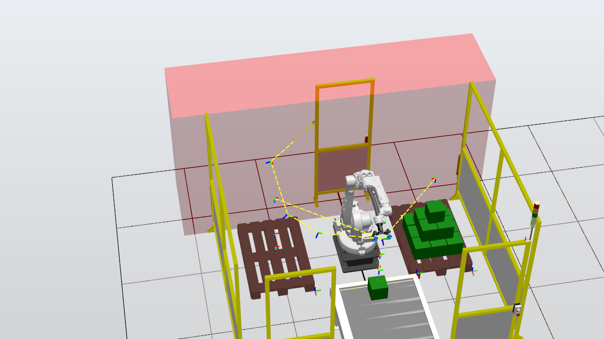

# 3D Pyramid Stacking Experiments — MCP-Driven Autonomous Robot Programming

## Overview

These experiments validate the RobotStudio MCP system's ability to autonomously generate RAPID code for a non-trivial 3D stacking task. An AI agent, given only a high-level instruction ("build a 3D pyramid with 14 blocks"), must query the scene, generate motion programs, handle conveyor-sensor coordination, and iteratively debug failures — all without human-written robot code.

Two experiments were conducted on consecutive days, each building a 14-block pyramid (9+4+1 layers) but with different block types and target pallets. The second experiment deliberately targeted harder conditions to stress-test the system's debugging loop.

---

## Experiment 1: Orange Block Pyramid (March 23)

**Objective:** Build a 3-layer pyramid (9+4+1 = 14 blocks) with orange blocks on Euro Pallet_2.

### Setup

| Parameter | Value |
|-----------|-------|
| Block type | Orange (Caja_pq) |
| Block size | 200 × 200 × 100 mm |
| Target pallet | Euro Pallet_2 (WO_Place_pq) |
| Grid spacing | 210 mm center-to-center |
| Generate signal | DO_Caja_pq |
| Sensor condition | DI_Sensor_Inf=1 AND DI_Sensor_Sup=0 |

### How `list_rapid_variables` Eliminated Manual Coordinate Calculation

During an earlier live demo for Volvo, placing blocks on Euro Pallet_2 required knowing the workobject `WO_Place_pq`. This workobject was not pre-defined in the controller, so the AI had to manually calculate it by:

1. Querying the robot base position from the scene graph
2. Querying the pallet position from the scene graph
3. Performing coordinate transformations (station coords → robot world coords → workobject definition)

This multi-step calculation caused a noticeable delay during the demo. The root cause was that the MCP server had no tool to **discover** existing RAPID variables by type — the agent could read a variable only if it already knew the exact name.

To fix this, we added the `list_rapid_variables` tool. In this experiment, instead of computing coordinates from scratch, the AI simply queried:

```
list_rapid_variables(typeFilter="wobjdata")
→ WO_Pick = [FALSE,TRUE,"",[[846,535,176],[1,0,0,0]],...]
  WO_Place_pq = [FALSE,TRUE,"",[[522,-650,-259],[1,0,0,0]],...]
```

The workobject was discovered instantly and used directly in the generated RAPID code — zero manual calculation, zero delay.

### Conveyor Strategy: Generate-Pick-Place Interleaving

A key lesson from prior work was that the conveyor can only hold ~4 large blocks at once. Generating all 14 blocks upfront would cause overflow, jamming, and blocks falling off. The AI correctly adopted a **one-at-a-time** strategy:

```
PROC GenPickPlace(...)
    Set DO_Caja_pq;        ! Generate one block
    WaitTime 2;
    Reset DO_Caja_pq;
    WaitUntil DI_Sensor_Inf=1 AND DI_Sensor_Sup=0;  ! Wait for sensor
    PickOrange;
    PlaceOrange x_off, y_off, z_off;
ENDPROC
```

Each block is generated, conveyed to the sensor, picked, and placed before the next one is created.

### Result: First-Attempt Success

The pyramid was completed in ~30 seconds with all 14 blocks correctly placed.

**Accuracy verification:**
- Layer X/Y spacing: 210 mm ✓
- Layer 2 offset from Layer 1: 105 mm ✓
- Z-spacing: 100 mm per layer (z = 0.248 → 0.348 → 0.448 m) ✓
- No blocks displaced during stacking ✓
- Layer 3 capstone centered above Layer 2 ✓

**Monitoring timeline (screenshots taken every 5s):**

| Time | Status | Screenshot |
|------|--------|------------|
| T+0s | Simulation started | `screenshots/attempt1_t000.png` |
| T+5s | 2 blocks placed | `screenshots/attempt1_t005.png` |
| T+10s | 5 blocks, 3×2 grid forming | `screenshots/attempt1_t010.png` |
| T+15s | 7 blocks, Layer 1 nearly done | `screenshots/attempt1_t015.png` |
| T+20s | 8 blocks placed | `screenshots/attempt1_t020.png` |
| T+25s | Layer 2 in progress (10 blocks) | `screenshots/attempt1_t025.png` |
| T+30s | All 14 blocks placed | `screenshots/attempt1_t030.png` |
| Final | Robot returned to HOME | `screenshots/attempt1_final.png` |


---

## Experiment 2: Green Block Pyramid (March 24)

**Objective:** Build the same 3-layer pyramid (9+4+1 = 14 blocks) but with green blocks on Euro Pallet — a significantly harder configuration.

### Why This Experiment Was Harder

| Factor | Orange (Exp 1) | Green (Exp 2) |
|--------|---------------|---------------|
| Block height | 100 mm | 200 mm |
| Target pallet | Euro Pallet_2 (close) | Euro Pallet (far, near reach limit) |
| Workobject | WO_Place_pq [522, -650, -259] | WO_Place_gr [566, 1365, -259] |
| Pick height | z = 80 mm | z = 180 mm |
| Release offset | +140 mm | +240 mm |
| Approach height | 600 mm (fixed) | Dynamic (release+200, min 400) |
| Joint config | Standard | ConfJ\Off + ConfL\Off required |

### How the BoundingBox API Enabled Correct Placement Heights

Previously, the MCP had no way to determine physical object dimensions — the AI could see positions and names, but not sizes. Block heights, placement offsets, and clearance distances had to be hardcoded or guessed, which broke whenever the workpiece changed.

We added bounding box data to `get_scene_objects`:

```
Caja_pq[Part]    sz(0.2, 0.2, 0.1)  ← orange: 200×200×100mm
Caja_gr[Part]    sz(0.2, 0.2, 0.2)  ← green:  200×200×200mm
```

In this experiment, the AI queried the green block dimensions and correctly derived:
- `GR_HEIGHT = 200` (block height for layer Z-offsets)
- `release_z = z_off + GR_HEIGHT + 40` (release height = layer offset + block height + 40mm clearance)
- `approach_z = release_z + 200` (approach from 200mm above release)

Without this API, the AI would have had to guess the green block height (or reuse the orange value of 100mm), resulting in blocks hovering 100mm above their target or colliding with already-placed blocks.

### Iterative Debugging: 8 Attempts to Success

Unlike the orange experiment, this one required **8 RAPID versions** to resolve cascading reachability and joint-limit issues. This iterative process demonstrates the AI agent's autonomous debugging capability.

#### Attempts 1–2: Reachability Failures

The initial placement base (`grPlaceBase_y = -300`) put the far-column blocks outside the robot's reach envelope. The AI diagnosed this from the error log ("Position outside reach, joint 3") and progressively shifted the placement base closer to the robot:

- v1: `y = -300` → Block 3 (col=+1) unreachable
- v2: `y = -350` → Still barely unreachable
- Also switched from fixed 800mm approach height to dynamic approach (`release_z + 200`) to reduce reach demands

#### Attempt 3: Partial Success — Then Joint 5 Limit

With `y = -400`, the first 6 blocks placed successfully. But at block 7, Joint 5 exceeded its 120° limit during MoveJ from HOME. Root cause: with `ConfJ\Off` enabled, the motion planner was free to choose any joint configuration, and over successive cycles, J5 drifted toward its limit.

#### Attempts 4–7: The J5 Trap

These attempts explored various recovery strategies, all unsuccessful:

| Attempt | Strategy | Outcome |
|---------|----------|---------|
| v4 | Changed tool orientation to [0,-0.707,0.707,0] | Broke pick targets entirely |
| v5 | Added MoveAbsJ to jHome | jHome has J5=111.71° — dangerously close to 120° limit |
| v6 | Added jCalib recovery position | Recovery still pushed J5 over on next MoveJ HOME |
| v7 | Combined jCalib + jHome | MoveAbsJ jHome still forced high J5 |

**Critical discovery:** Simulation reset does NOT reset robot joint positions. Once J5 drifted past its limit, the controller entered an error state that persisted across sim restarts. Recovery required uploading a minimal module with MoveAbsJ to an all-zeros position.

#### Attempt 8: The Fix — jCalib + MoveJ (Not MoveAbsJ)

The breakthrough insight: `MoveAbsJ jHome` forces J5 to exactly 111.71° (the HOME position's true J5 value). But `MoveJ HOME` with `ConfJ\Off` lets the motion planner choose a J5 angle that satisfies the Cartesian target while staying within limits.

The solution: after each place cycle, reset J5 to 0° via `MoveAbsJ jCalib`, then move to HOME via `MoveJ` (not `MoveAbsJ`):

```
PROC PlaceGreen(...)
    ! ... place block ...
    MoveAbsJ jCalib, v1000, z100, TCP_VentosaTool;   ! J5 → 0°
    MoveJ HOME, v1000, z100, TCP_VentosaTool\WObj:=wobj0;  ! Solver picks safe J5
ENDPROC
```

### Result: All 14 Green Blocks Placed

Starting from the calibration position (all joints at 0°), v8 successfully completed the full pyramid.

**Final positions:**
- Layer 1: 9 blocks at z = 0.348 m (3×3 grid, 210 mm spacing)
- Layer 2: 4 blocks at z = 0.548 m (2×2 grid, centered with 105 mm offset)
- Layer 3: 1 capstone at z = 0.748 m
- Z-spacing: 200 mm per layer = green block height ✓



---

## Comparison and Key Takeaways

### Experiment Comparison

| Metric | Orange Pyramid | Green Pyramid |
|--------|---------------|---------------|
| Attempts to success | 1 | 8 |
| Total RAPID versions | 1 | 8 |
| Completion time | ~30s | ~95s |
| Primary challenge | None | Joint 5 limit + reachability |
| MCP capability used | `list_rapid_variables` | BoundingBox API |

### Lessons Learned

1. **Conveyor capacity is limited.** Never generate all blocks upfront. Use a generate-pick-place interleaving pattern with one block at a time.

2. **`list_rapid_variables` eliminates coordinate guesswork.** The AI can discover existing workobjects, targets, and tools instantly instead of computing them from scene graph transforms.

3. **BoundingBox API enables dimension-aware placement.** Without knowing block heights, the AI cannot compute correct release heights for multi-layer stacking. This API makes the system adaptive to different workpiece sizes.

4. **Joint limits require active management.** With `ConfJ\Off`, the motion planner may drift joints toward limits over repeated cycles. The fix is to actively reset joints to a known-safe position (calibration pose) between cycles.

5. **`MoveJ` vs `MoveAbsJ` matters critically.** `MoveAbsJ` forces exact joint values (which may be near limits); `MoveJ` lets the solver find a joint configuration that satisfies the Cartesian target while respecting limits.

6. **Simulation reset does not reset joint positions.** A stuck controller requires an explicit recovery module to move joints back to a safe state.

7. **Stage-by-stage screenshot monitoring is essential.** Problems like conveyor overflow or joint drift are only visible during execution, not in the final result.
